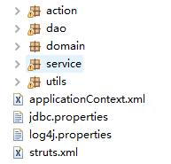
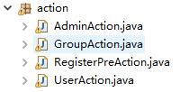
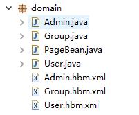
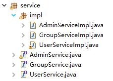
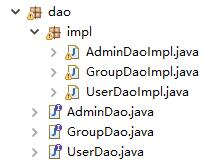
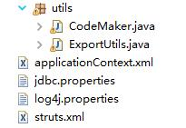
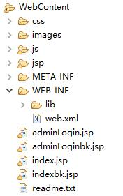

本项目是使用 Struts2+Hibernate3+Spring3,基于 MVC 开发模式的一个简单实例，第一篇先建立项目总体包结构，后续将详细解释项目细节。

<!-- more -->

## 1、整体包结构

## 2、action 包

## 3、domain 实体包

## 4、service 层

## 5、dao 层

## 6、util 工具包

## 7、页面层

