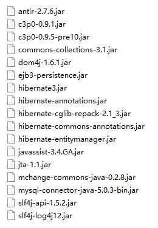
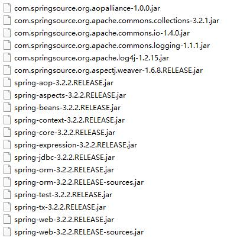

本节将关于本项目所需导入的 jar 包进行逐一解释，基本适用于普通的 Struts2+Hibernate3+Spring3 的项目， 此为相对较老的组合版本，若使用 Hibernate4 或 Mybatis 等其他较新框架，请自行查阅相关资料。

<!-- more -->

## 1、struts2 基础必备包（解压 blank.war 可得）

### 本项目使用 struts2.3.4.1

附加 Jar 解释：

- struts2-convention-plugin-2.3.4.1.jar——支持 struts2 的注解开发
<pre>
ssh三大框架都支持注解开发，ssh整合有三种方式：

1.  带有 Hibernate 配置文件（hibernate.cfg.xml）
2.  不带有 Hibernate 配置文件（本项目所采用）
3.  纯注解开发
</pre>

- struts2-spring-plugin-2.3.4.1.jar——用于整合 spring
<pre>
spring的jar包中也有一个spring-struts2-plugin.jar，和该包一样，引入其一即可。
</pre>

## 2、hibernate3 基础必备包

### 本项目使用 hibernate3.3.1

- 根路径 hibernate3.jar——核心 jar 包
- required 目录所有 jar 包
- hibernate 日志记录——slf4j-log4j.jar
- 数据库驱动包——mysql-connector-java.jar（本项目使用 mysql 数据库）
<pre>
hibernate中已引入slf4j（slf4j-api.jar）,但其不作具体日志记录,所以需要引入slf4j-log4j.jar整合log4j
</pre>

## 3、spring 基础必备包

<pre>
	根据具体开发情况引入IoC或AOP的jar包
</pre>

### 本项目使用 spring3.2.2

spring 基本 jar 包包括

1.  IoC 开发

- spring-beans.jar
- spring-context.jar
- spring-core.jar
- spring-expression.jar
- com.springsource.org.apache.log4j.jar——作日志记录
- com.springsource.org.apache.commons.logging.jar——日志整合，不作具体日志记录，用于整合其他日志系统

2.  AOP

- spring-aop.jar
- spring-aspect.jar——整合 aspect
- com.spinrgsource.org.aopalliance.jar——aop 联盟
- com.springsource.org.aspectj.weaver.jar

3.  其他

- spring-tx.jar——事务管理
- spring-jdbc.jar——jdbc 模板
- spring-orm.jar——整合 hibernate
- spring-web.jar——整合 web 项目
- spring-test.jar——整合 JUnit 单元测试
- c3p0.jar——c3p0 连接池

> 在实际开发中，一开始的 jar 包导入环节总是没有清晰的头绪，原因就在于实际开发经验不足，对框架理解不够，此处就体现出阅读框架源码的重要性。

> “框架官网文档就是学习框架的最好资料” 与君共勉

- [struts 官方文档](http://struts.apache.org/maven/struts2-core/apidocs/index.html)
- [hibernate 官方文档](http://docs.jboss.org/hibernate/orm/5.2/javadocs/)
- [spring 官方文档](http://docs.spring.io/spring/docs/5.0.0.M2/javadoc-api/)
