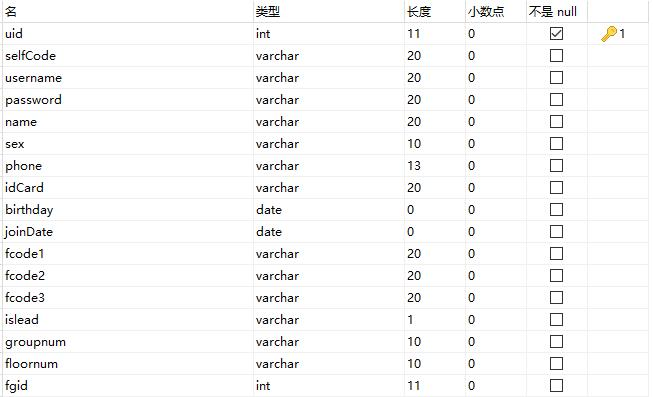
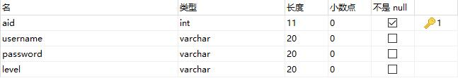

## 1.  Web项目入口——web.xml

```xml
<!-- spring核心监听器 -->
<listener>
  <listener-class>org.springframework.web.context.ContextLoaderListener</listener-class>
</listener>
<!-- ctrl+shift+T:contextLoaderListener监听器全路径 -->

<!-- 默认情况会加载WEB-INF中的配置文件 -->
<!-- 配置全局初始化参数：设置为加载classes中的配置文件 -->
<context-param>
  <param-name>contextConfigLocation</param-name>
  <param-value>classpath:applicationContext.xml</param-value>
</context-param>

<!-- struts核心过滤器（与传统servlet配置类似） -->
<filter>
  <filter-name>struts</filter-name>
  <filter-class>org.apache.struts2.dispatcher.ng.filter.StrutsPrepareAndExecuteFilter</filter-class>
</filter>
<!-- ctrl+shift+T:strutsPrepareAndExecuteFilter -->

<filter-mapping>
  <filter-name>struts</filter-name>
  <url-pattern>/*</url-pattern>
</filter-mapping>

<display-name>ssh</display-name>
<welcome-file-list>
  <welcome-file>index.jsp</welcome-file>
</welcome-file-list>
```
## 2.  struts配置文件——struts.xml

```xml
<struts>
	<package name="ssh" extends="struts-default">
		<action name="user_*" class="userAction" method="{1}">
			<result name="input">/index.jsp</result>
			<result name="success" type="redirect">/jsp/layout.jsp</result>
			<result name="info" type="redirect">/jsp/myinfo.jsp</result>
			<result name="invi">/jsp/invi.jsp</result>
			<result name="regSuccess">/jsp/regSuccess1.jsp</result>
			<result name="getCodes">/jsp/mycode.jsp</result>
			<result name="toHome">/jsp/layout.jsp</result>
			<result name="linkPersion">/jsp/otherInfo.jsp</result>
			<result name="update">/jsp/updateUser.jsp</result>
			<result name="updateSucc" type="redirectAction">admin_findAll</result>
			<result name="del" type="redirectAction">admin_findAll</result>
			<result name="add">/jsp/addUser.jsp</result>
			<result name="addSucc" type="redirectAction">admin_findAll</result>
		</action>
		<action name="admin_*" class="adminAction" method="{1}">
			<result name="input" type="redirect">/index.jsp</result>
			<result name="findAll">/jsp/adminHome.jsp</result>
			<result name="success">/jsp/adminHome.jsp</result>
		</action>
		<action name="group_*" class="groupAction" method="{1}">
			<result name="findGroup">/jsp/groupList.jsp</result>
			<result name="addSucc">/jsp/groupList.jsp</result>
			<result name="add">/jsp/addList.jsp</result>
		</action>
		<action name="registerPre" class="registerPreAction">
			<result name="success" type="redirect">/jsp/register.jsp</result>
		</action>
	</package>
</struts>

```
## 3.  hibernate配置文件（在ssh整合中该配置文件可省略）
## 4.  hibernate映射文件——User.hbm.xml（与实体属性名称相对应，在启动服务器后会自动生成表）
User(用户实体)
```xml
<hibernate-mapping>
	<class name="com.barrnet.ssh.domain.User" table="user">
		<id name="uid" column="uid">
			<generator class="native" />
		</id>
		<property name="selfCode" column="selfCode" length="20" />
		<property name="username" column="username" length="20" />
		<property name="password" column="password" length="20" />
		<property name="name" column="name" length="20" />
		<property name="sex" column="sex" length="10" />
		<property name="phone" column="phone" length="13" />
		<property name="idCard" column="idCard" length="20" />
		<property name="birthday" type="date" column="birthday" />
		<property name="joinDate" type="date" column="joinDate" />
		<property name="fcode1" column="fcode1" length="20" />
		<property name="fcode2" column="fcode2" length="20" />
		<property name="fcode3" column="fcode3" length="20" />
		<property name="islead" column="islead" length="1" />
		<property name="groupnum" column="groupnum" length="10" />
		<property name="floornum" column="floornum" length="10" />

		<many-to-one name="group" class="com.barrnet.ssh.domain.Group"
			column="fgid" />
	</class>
</hibernate-mapping>
```

实体属性

```java
private int uid;			//唯一标识
private String selfCode;	//注册码
private String username;	//登陆用户名
private String password;	//登陆密码
private String name;		//真实姓名
private String sex;			//性别
private String phone;		//手机号
private String idCard;		//身份证号
private Date birthday;		//出生日期
private Date joinDate;		//注册时间
private String fcode1;		//邀请码1
private String fcode2;		//邀请码2
private String fcode3;		//邀请码3
private String islead;		//是否组长
private String groupnum;	//组号
private String floornum;	//层号
private Group group;
```
生成表



Admin(管理员实体)

```xml
<hibernate-mapping>
	<class name="com.barrnet.ssh.domain.Group" table="ggroup">
		<id name="gid" column="gid">
			<generator class="native"/>
		</id>
		<property name="gno" column="gno" length="5"/>
		<property name="gcount" column="gcount" length="1"/>
		
		<set name="users">
			<key column="fgid"/>
			<one-to-many class="com.barrnet.ssh.domain.User"/>
		</set>
	</class>
</hibernate-mapping>
```
实体属性

```java
private int aid;			//唯一标识
private String username;	//登陆用户名
private String password;	//登陆密码
private String level;		//管理员等级（用以区分普通管理员和超级管理员）
```
生成表


## 5.  spring配置文件——application.context.xml(启动服务器时加载spring核心配置文件)
```xml
<beans xmlns="http://www.springframework.org/schema/beans"
	xmlns:xsi="http://www.w3.org/2001/XMLSchema-instance" xmlns:context="http://www.springframework.org/schema/context"
	xmlns:aop="http://www.springframework.org/schema/aop" xmlns:tx="http://www.springframework.org/schema/tx"
	xsi:schemaLocation="http://www.springframework.org/schema/beans 
	http://www.springframework.org/schema/beans/spring-beans.xsd
	http://www.springframework.org/schema/context 
	http://www.springframework.org/schema/context/spring-context.xsd
	http://www.springframework.org/schema/aop
	http://www.springframework.org/schema/aop/spring-aop.xsd
	http://www.springframework.org/schema/tx 
	http://www.springframework.org/schema/tx/spring-tx.xsd">

	<!-- 引入外部属性文件 -->
	<context:property-placeholder location="classpath:jdbc.properties" />
	<!-- 配置c3p0连接池 -->
	<bean id="dataSource" class="com.mchange.v2.c3p0.ComboPooledDataSource">
		<property name="driverClass" value="${jdbc.driverClass}" />
		<property name="jdbcUrl" value="${jdbc.url}" />
		<property name="user" value="${jdbc.username}" />
		<property name="password" value="${jdbc.password}" />
	</bean>

	<!-- 配置hibernate -->
	<bean id="sessionFactory"
		class="org.springframework.orm.hibernate3.LocalSessionFactoryBean">
		<!-- 注入连接池 -->
		<property name="dataSource" ref="dataSource" />
		<!-- 配置hibernate属性 -->
		<property name="hibernateProperties">
			<props>
				<prop key="hibernate.dialect">org.hibernate.dialect.MySQLDialect</prop>
				<prop key="hibernate.show_sql">true</prop>
				<prop key="hibernate.format_sql">true</prop>
				<prop key="hibernate.hbm2ddl.auto">update</prop>
			</props>
		</property>
		<!-- 加载hibernate映射文件 -->
		<property name="mappingResources">
			<list>
				<value>com/barrnet/ssh/domain/User.hbm.xml</value>
				<value>com/barrnet/ssh/domain/Admin.hbm.xml</value>
				<value>com/barrnet/ssh/domain/Group.hbm.xml</value>
			</list>
		</property>
	</bean>

	<!-- 配置Action的类 -->
	<bean id="userAction" class="com.barrnet.ssh.action.UserAction"
		scope="prototype">
		<property name="userService" ref="userService" />
	</bean>
	<bean id="adminAction" class="com.barrnet.ssh.action.AdminAction"
		scope="prototype">
		<property name="adminService" ref="adminService" />
	</bean>
	<bean id="groupAction" class="com.barrnet.ssh.action.GroupAction"
		scope="prototype">
		<property name="groupService" ref="groupService" />
	</bean>
	<bean id="registerPreAction" class="com.barrnet.ssh.action.RegisterPreAction"
		scope="prototype">
	</bean>

	<!-- 配置业务层的类 -->
	<bean id="userService" class="com.barrnet.ssh.service.impl.UserServiceImpl">
		<property name="userDao" ref="userDao" />
	</bean>
	<bean id="adminService" class="com.barrnet.ssh.service.impl.AdminServiceImpl">
		<property name="adminDao" ref="adminDao" />
	</bean>
	<bean id="groupService" class="com.barrnet.ssh.service.impl.GroupServiceImpl">
		<property name="groupDao" ref="groupDao" />
	</bean>

	<!-- 配置dao的类 -->
	<bean id="userDao" class="com.barrnet.ssh.dao.impl.UserDaoImpl">
		<property name="sessionFactory" ref="sessionFactory" />
	</bean>
	<bean id="adminDao" class="com.barrnet.ssh.dao.impl.AdminDaoImpl">
		<property name="sessionFactory" ref="sessionFactory" />
	</bean>
	<bean id="groupDao" class="com.barrnet.ssh.dao.impl.GroupDaoImpl">
		<property name="sessionFactory" ref="sessionFactory" />
	</bean>

	<!-- 配置事务管理 -->
	<bean id="transactionManager"
		class="org.springframework.orm.hibernate3.HibernateTransactionManager">
		<property name="sessionFactory" ref="sessionFactory" />
	</bean>

	<!-- 开启注解事务 -->
	<tx:annotation-driven transaction-manager="transactionManager" />
</beans>
```