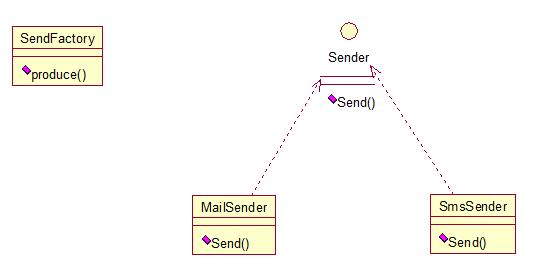

## 一、工厂方法模式分类（3 种）

1.  普通工厂模式
2.  多个工厂方法模式
3.  静态工厂方法模式

## 二、工厂方法模式详解

### （1）普通工厂模式

普通工厂模式就是建立一个**工厂类**，对实现了**同一接口**的一些**类**进行**实例**的创建。



```java
// 1、创建不同产品的共同接口
public interface Sender {
  /**
   * 邮寄接口中有一个邮寄方法待实现
   */
  public void Send();
}
```

```java
/**
 * 2、（实现类）邮件邮寄类实现了邮寄接口，实现其邮寄的抽象方法
 * @author barnett
 */
public class MailSender implements Sender {

  @Override
  public void Send() {
    System.out.println("I am MailSender!");
  }
}
```

```java
/**
 * 短信邮寄类实现了邮寄接口，实现其邮寄的抽象方法
 * @author barnett
 *
 */
public class SmsSender implements Sender {

  @Override
  public void Send() {
    System.out.println("I am SmsSender!");
  }
}
```

```java
/**
 * 3、工厂类，负责多次制造产品（new出复用的类）
 * @author barnett
 */
public class SendFactory {

  /**
   * 工厂类中的生产方法
   * @param type	输入要生产的产品类型
   * @return	返回一个产品
   */
  public Sender produce(String type) {
    if("mail".equals(type)) {
      return new MailSender();
    } else if("sms".equals(type)) {
      return new SmsSender();
    } else {
      System.out.println("请输入正确的类型！");
      return null;
    }
  }
}
```

```java
/**
 * 4、测试类，实例一个工厂，生产多个产品
 * @author barnett
 *
 */
public class FactoryTest {

  public static void main(String[] args) {
    // 创建一个工厂（可多次生产）
    SendFactory factory = new SendFactory();
    // 使用工厂按照要求生产相应产品
    Sender sender = factory.produce("sms");
    // 调用产品的方法
    sender.Send();
    Sender sender2 = factory.produce("mail");
    sender2.Send();
  }
}
```

#### 工厂优势

> 1、 实例出一个工厂，再生产工厂内可以生产的产品，则只需要调用工厂的生产方法，通过传入不同的参数，生产不同的产品
> 2、传统方式则每次要生产一个产品时都需要实例化，然后调用生产方法
> 3、这样一来，要生产产品时，无需了解内部细节，交由工厂管理，节省资源

#### （2）多个工厂方法模式

> 多个工厂方法模式，是对普通工厂方法模式的改进，在普通工厂方法模式中，如果传递的**字符串出错**，则不能正确创建对象
>
> 而多个工厂方法模式是提供**多个工厂方法**，分别创建对象。


```java
/**
 * 工厂类，负责多次制造产品
 * @author barnett
 *
 */
public class MultiMethodSendFactory {

  /**
   * 专门生产邮件邮寄器的方法
   * @return
   */
  public Sender produceMail() {
    return new MailSender();
  }

  /**
   * 专门生产短信邮寄器的方法
   * @return
   */
  public Sender produceSms() {
    return new SmsSender();
  }
}
```

```java
/**
 * 测试类，实例一个工厂，生产多个产品
 * @author barnett
 *
 */
public class MultiMethodFactoryTest {

  public static void main(String[] args) {
    // 创建一个工厂（可多次生产）
    MultiMethodSendFactory factory = new MultiMethodSendFactory();
    // 根据不同的需求调用不同的方法
    Sender mailSender = factory.produceMail();
    mailSender.Send();
    Sender smsSender = factory.produceSms();
    smsSender.Send();
  }
}
```

### （3）静态工厂方法模式

> 将上面的多个工厂方法模式里的**方法**置为**静态**的，**不需**要创建**实例**，**直接调用**即可。

```java
/**
 * 工厂类，负责多次制造产品
 * @author barnett
 */
public class StaticMethodSendFactory {

  /**
   * 专门生产邮件邮寄器的方法
   * @return
   */
  public static Sender produceMail() {
    return new MailSender();
  }

  /**
   * 专门生产短信邮寄器的方法
   * @return
   */
  public static Sender produceSms() {
    return new SmsSender();
  }
}
```

```java
/**
 * 测试类，直接调用工厂中的静态方法，生产产品
 * @author barnett
 */
public class StaticMethodFactoryTest {

  public static void main(String[] args) {
    Sender mailSender = StaticMethodSendFactory.produceMail();
    mailSender.Send();
    Sender smsSender = StaticMethodSendFactory.produceSms();
    smsSender.Send();
  }
}
```
