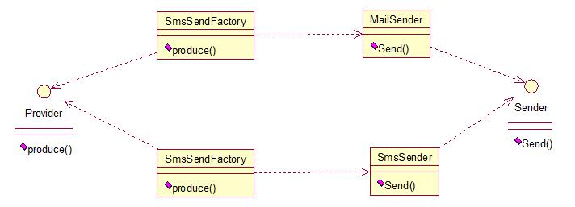

### 一、工厂方法模式缺陷

工厂方法模式有一个问题就是，类的创建依赖工厂类，也就是说，如果想要**拓展程序**，必须**修改工厂**类，这违背了设计模式六大原则第一条[闭包原则](http://blog.csdn.net/sinat_16791487/article/details/53666953)。

所以，从设计角度考虑，有一定的问题，如何解决？就用到抽象工厂模式，创建**多个工厂类**，这样一旦需要增加新的功能，直接增加新的工厂类就可以了，不需要修改之前的代码。



### 二、抽象工厂模式实现

```java
/**
 * 1、邮寄接口，有一个抽象邮寄方法待实现
 * @author barnett
 *
 */
public interface Sender {

	public void send();
}
```

```java
/**
 * 2、实现类，邮件邮寄类实现邮寄接口，实现其邮寄的方法
 * @author barnett
 *
 */
public class MailSender implements Sender {

	@Override
	public void send() {
		System.out.println("I am MailSender!");
	}
}
```

```java
/**
 * 短信邮寄类实现邮寄接口，实现其邮寄方法
 * @author barnett
 *
 */
public class SmsSender implements Sender {

	@Override
	public void send() {
		System.out.println("I am SmsSender!");
	}
}
```

```java
/**
 * 3、提供器接口，返回邮寄对象，其生产方法待实现
 * 工厂依靠实现该接口，生产产品（Sender）
 * @author barnett
 *
 */
public interface Provider {

	public Sender produce();

}
```

```java
/**
 * 4、工厂，邮件邮寄工厂，负责专门生产邮件邮寄实例
 * @author barnett
 *
 */
public class SendMailFactory implements Provider {

	@Override
	public Sender produce() {
		return new MailSender();
	}
}
```

```java
/**
 * 短信邮寄工厂，专门生产短信邮寄实例
 * @author barnett
 *
 */
public class SendSmsFactory implements Provider {

	@Override
	public Sender produce() {
		return new SmsSender();
	}
}
```

```java
/**
 * 5、测试类
 * @author barnett
 *
 */
public class Test {

	public static void main(String[] args) {
		// 实例一个邮件工厂(因其实现了提供器接口，可返回一个具有专门生产某种产品生产方法的实例）
		Provider provider = new SendMailFactory();
		// 通过该实例生产产品
		Sender sender = provider.produce();
		// 调用产品的方法
		sender.send();
		// 实例生产另一种产品的工厂
		SendSmsFactory factory = new SendSmsFactory();
		Sender sender2 = factory.produce();
		sender2.send();
	}
}
```

### 三、抽象工厂模式优势

> 若想生产新的产品，只需一个**实现类**，实现 Sender 接口，再创建一个专门用于生产该产品的**工厂类**，实现 Provider 接口，这样一来，**无需改动**原有代码，**拓展性好**。
