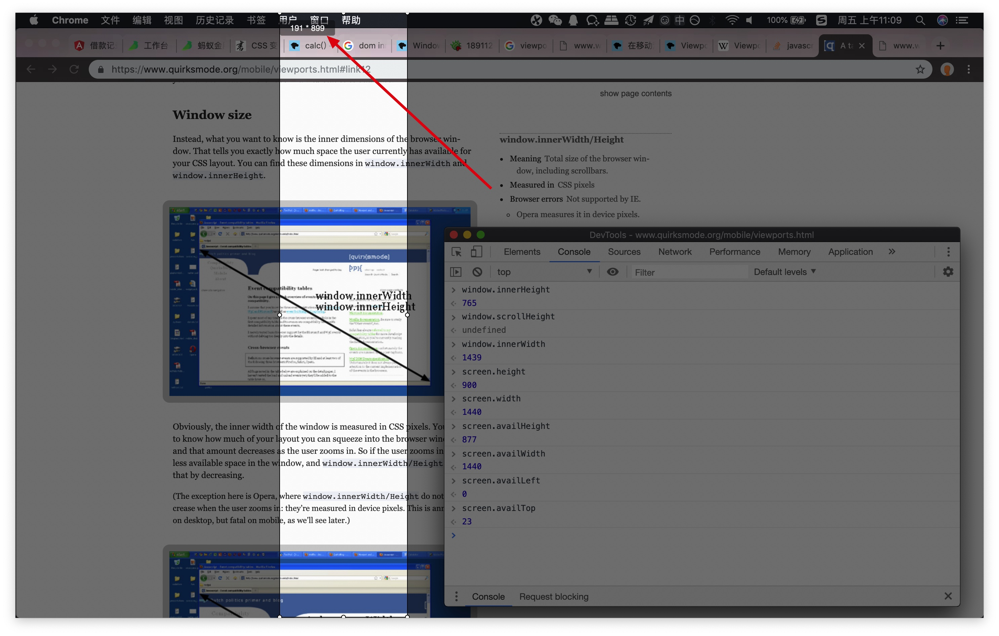
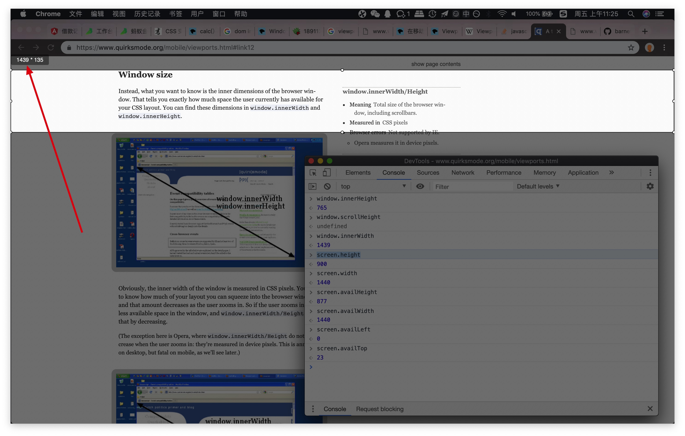
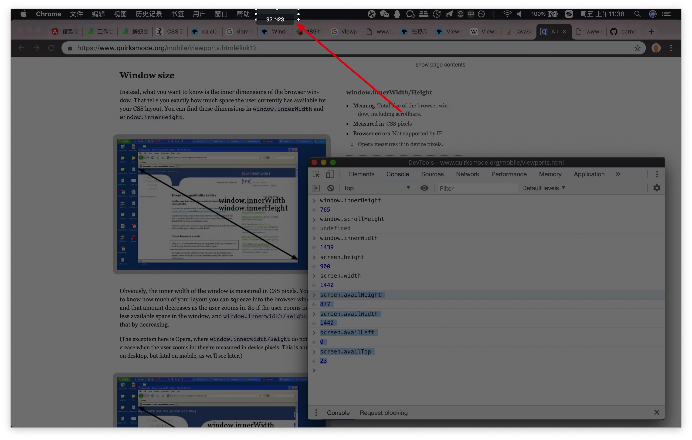
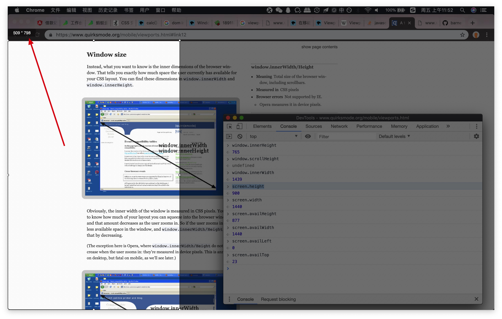
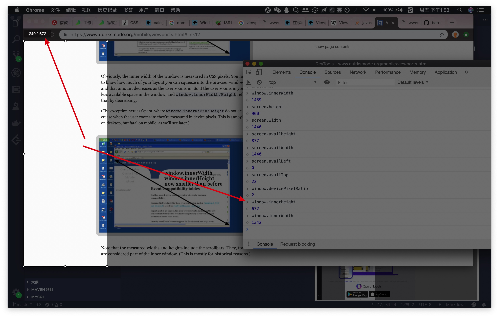
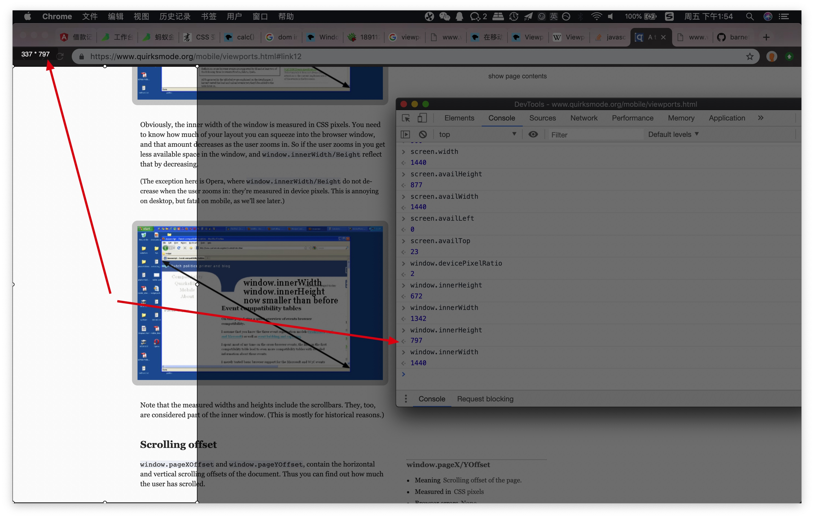
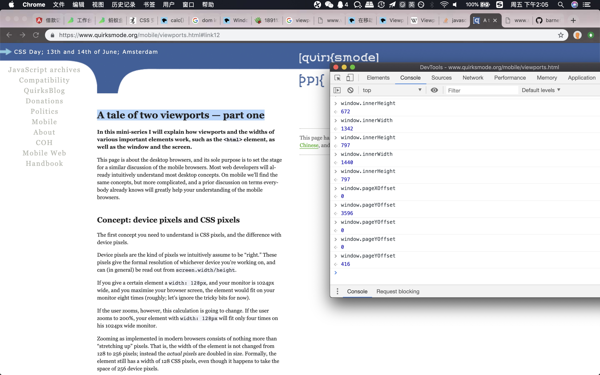
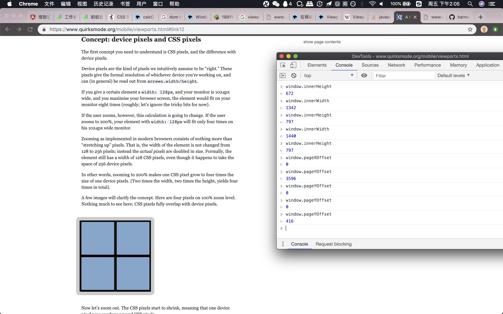
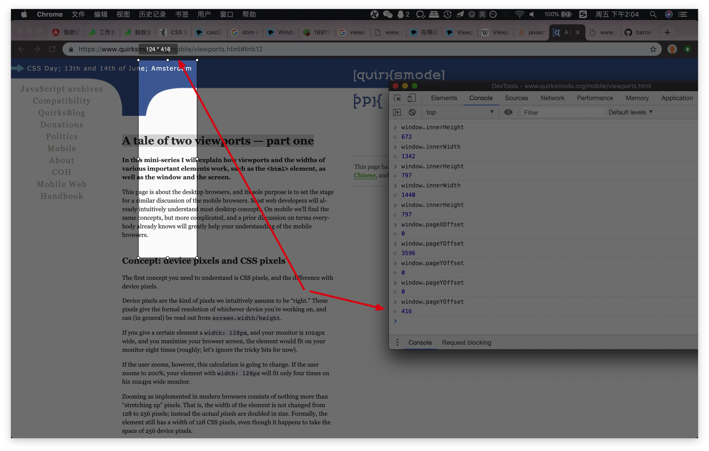
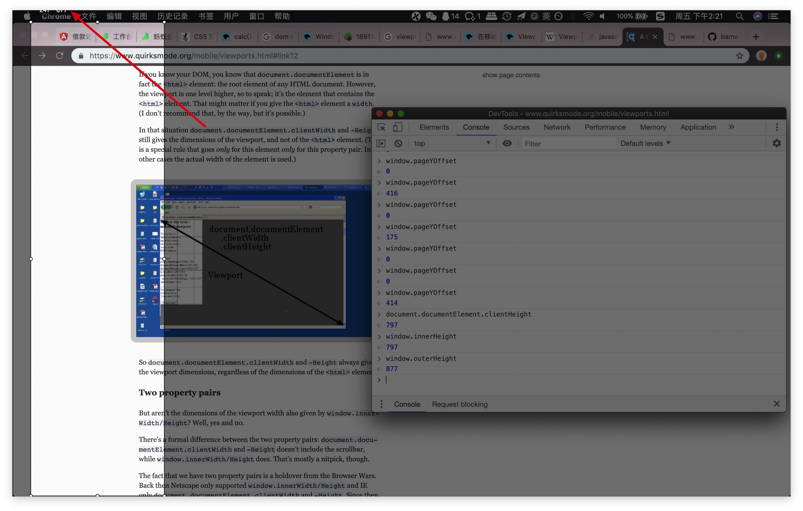

关于 WEB 中宽高的一些整理

<!--more-->

## 屏幕宽高（screen.width & screen.height）

屏幕宽高的计量单位是`设备像素`（但 IE8 对其计量单位使用`CSS像素`）





由此可见

1. 截图工具对于截图的计量（值和单位）基本与 screen.width & screen.height 一致（差 1）
2. 截图工具是对于用户的设备屏幕上的某个区域进行选择
3. `screen`的属性更偏向于表示物理设备的属性参数
4. `window`的属性更偏向于表示 WEB 的参数

进一步观察

`screen`还有 4 个更加“实用”的属性

```
screen.availHeight
877
screen.availWidth
1440
screen.availLeft
0
screen.availTop
23
```

为什么说实用呢，因为这些屏幕的实际宽高并不一定在用户应用中都能被使用，比如这里可以看到`screen.availTop`有 23 的长度是不在可用范围呢，那这段长度是什么呢，见下图



其实是设备（电脑）系统本身的状态栏高度，这一部分高度在浏览器未全屏显示的时候的确是不算在应用（浏览器）高度内的，同时很明显可以看到`screen.availHeight + screen.availTop = 877 + 23 = 900 = screen.height`，这三个属性的值形成一个完整的闭环，详细的描述了设备屏幕在不同使用场景下的参数

## 窗体宽高（window.width & window.height）

窗体宽高的计量单位使用`CSS像素`（但不被 IE 支持，并且欧朋浏览器对其计量单位使用`设备像素`）

以上所说的计量单位区分是因为在浏览器中访问这些对象属性的时候返回值只是一个数字，而没有单位，其在不同的环境中（浏览器类型）计算方式并不同




以下两张图可见

window.innerHeight & window.innerWidth 是随着浏览器视窗当前的真实展现宽高变化的





## 滑动偏移量（Scrolling offset）

实验如图



当前位置时

```
window.pageYOffset
0
```



而滑动到此位置时

```
window.pageYOffset
416
```

两次之前的滑动差值第二次减去第一次的 416 其实是屏幕在 Y 轴上的滚动量，并且由于这是计算视窗滑动量，所以在不同的浏览器上计算方式没有差别



存在如下一个关系

```
document.documentElement.clientHeight
797
window.innerHeight
797
window.outerHeight
877
screen.availHeight
877
```



还有一个反应 WEB 文档真实宽高的属性

```
document.documentElement.scrollHeight
12061
```

参考文章

- [A tale of two viewports — part one](https://www.quirksmode.org/mobile/viewports.html#link12)
