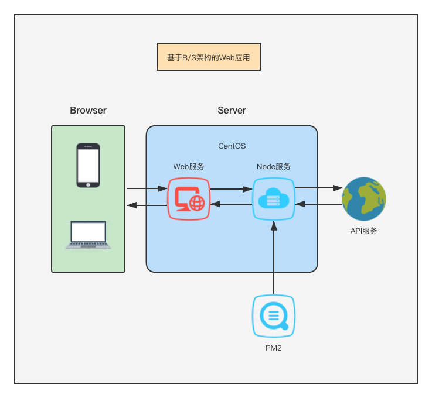

使用 vscode 远程开发一个全栈 Web 项目

<!--more-->

## 技术栈&工具

### 前端

- [Vue.js](https://vuejs.org/index.html)

### 后端

- [Express](https://expressjs.com/)
- [PM2](https://pm2.keymetrics.io/)

### 工具

- [Nodejs](https://nodejs.org/en/about/)
- [VScode](https://code.visualstudio.com/docs/remote/remote-overview)
- [百度地图 jssdk](https://lbsyun.baidu.com/index.php?title=jspopular3.0)

## 开发准备

- 一台 Linux 系统的服务器(centos)
- 搭建基于`nodejs`的服务端环境
  1. 使用`nvm`管理`nodejs`环境(curl -o- https://raw.githubusercontent.com/nvm-sh/nvm/v0.35.3/install.sh | bash)
  2. 安装`pm2`用于`nodejs`程序的进程管理(npm i -g pm2)
- 搭建基于`Vue`的前端环境
  1. 使用`@vue/cli`进行前端项目初始化(npm install -g @vue/cli)
  2. [可选]使用[travis](https://travis-ci.com/)+[github action](https://docs.github.com/en/github/administering-a-repository/managing-repository-settings/disabling-or-limiting-github-actions-for-a-repository#allowing-specific-actions-to-run)进行项目 CI 管理

## 功能

- 获取精确到城市级别的位置信息
- 位置信息地图可视化展示

## 源码解析

### 后端核心逻辑

根据`express`获取到的请求获取来源 IP，通过调用[第三方](https://ipapi.com/)API 获取位置信息

```js
app.get("/api/loc", (req, res) => {
  let ip = req.ip || req.ips[0];
  if (ip.indexOf(":") > -1) {
    ip = ip.split(":")[3];
  }
  if (ip) {
    const url = `http://api.ipapi.com/${ip}?access_key=xxx`;
    http.get(url, (httpRes) => {
      let chunkData = "";
      httpRes.on("data", (chunk) => {
        chunkData += chunk;
      });
      httpRes.on("end", () => {
        const jsonObj = JSON.parse(chunkData);
        res.status(200);
        res.json({
          errno: 0,
          data: jsonObj,
        });
      });
    });
  } else {
    res.status(400);
    res.json({
      errno: 400,
      errmsg: "没有获取到IP",
    });
  }
});
```

### 前端核心逻辑

#### 接口请求及数据处理

```js
getLoc() {
  let url = `//${account.api}/api/loc`;
  axios
    .get(url)
    .then(res => res.data)
    .then(res => {
      if (+res.errno === 0) {
        const obj = res.data;
        if (obj.latitude) {
          this.lat = obj.latitude * 1
          this.lng = obj.longitude * 1
        }
        this.rows = Object.keys(obj)
          .filter(key => Object.keys(this.dataMap).includes(key))
          .map(key => {
            return key === 'location' ? {
              label: '国旗',
              value: obj[key]['country_flag_emoji']
            } : {
              label: this.dataMap[key],
              value: obj[key]
            };
          });
      }
    });
},
```

#### 地图 SDK 加载

```js
function baiduMap(ak) {
  return new Promise((resolve, reject) => {
    window.baiduMap = function () {
      resolve();
    };
    let script = document.createElement("script");
    script.type = "text/javascript";
    script.src = `http://api.map.baidu.com/api?type=webgl&v=3.0&ak=${ak}&callback=baiduMap`;
    script.onerror = reject;
    document.head.appendChild(script);
  });
}
```

#### 地图组件

```vue
<template>
  <div class="map-wrap">
    <div id="container"></div>
  </div>
</template>
<script>
import { baiduMap } from "../../common/js/utils";
import { account } from "../../../account";
export default {
  props: {
    lat: Number,
    lng: Number,
  },
  data() {
    return {
      ak: account.ak,
      zoomSize: 16,
      map: null,
      clickedAddr: "",
    };
  },
  watch: {
    lat() {
      this.renderMap();
    },
  },
  mounted() {
    if (this.lat && window.BMapGL) {
      this.initMap();
    }
  },
  methods: {
    renderMap() {
      const that = this;
      this.$nextTick(() => {
        baiduMap(this.ak).then(() => {
          that.initMap();
        });
      });
    },
    initMap() {
      const map = new BMapGL.Map("container");
      this.locationByLatLng(map);
      this.commonSet(map);
      this.showLoactionControl(map);
      this.observeMapClick(map);
      this.getAddress();
      this.locationByBrowser(map);
      this.locateByOriginBrowser();
    },
  },
};
</script>
<style lang="scss" scoped>
.map-wrap {
  margin: 20px;
  position: relative;
}
#container {
  height: 300px;
}
</style>
```

### 工程化基建

#### vConsole

隐式加载 vConsole，通过热键唤起 vConsole 面板

```js
clickTitle() {
  this.clickCount = this.clickCount + 1
  if (this.clickCount === 5) {
    if (!this.consoleShow) {
      this.consoleShow = true
      this.showVConsole()
    }
  }
  setTimeout(() => {
    this.clickCount = 0
  }, 2000)
}
```

#### PM2

启动后端服务时添加`--time`参数，为日志添加时间

使用`pm2 logs`查看后端服务日志

### 项目部署

#### 后端服务

```
pm2 start api.js --name me
```

#### 前端服务

```
npm run build
```

将`dist`拖拽到`vscode remote`访问到的服务机

### 架构

服务机固定单端口同时部署前端服务和后端服务于不同的路由



#### 前端服务

```js
app.use(express.static(path.join(__dirname, "../dist")));
app.get("/", (req, res) => {
  res.sendFile(path.join(__dirname, "../dist/", "index.html"));
});
```

#### 后端服务

```js
app.get('/api/loc', (req, res) => {
  res.status(400)
  res.json({
    errno: 200,
    data: {}
  })
}
```

## 关于 CI

Vue CLI 官方文档中提供了两种基于 Github Pages 的 CI 方式，其中第一个坑就是`不要看中文文档`，因为中文文档“年久失修”，很多错误的地方也没人勘误，建议以[英文文档](https://cli.vuejs.org/guide/deployment.html#github-pages)为准。

接着就是关于两种 CI 方式，其中第一种手动方式没什么问题，本地写一个 Shell 脚本，需要发布项目的时候手动执行，核心逻辑如下

1. build 生成 dist
2. 进到 dist 目录，将 dist 目录初始化为一个 git 项目并提交，强制推送到当前项目远程的 gh-pages 分支
3. 退出 dist 目录

另外就是通过集成 travis 的自动化方式，核心步骤如下

1. 在本地安装 travis 客户端(gem install travis)
2. 使用 github 登录 travis(travis login --com --github-token xxx)
3. 设置 travis 变量（用于 travis 调用 github API 来拉取你的 github 项目）(travis env set GITHUB_TOKEN xxx)
4. 项目中增加 travis 配置文件
5. 在 travis 网站观察 CI 结果

这里面坑很多，首先第一个就是`Vue CLI官方文档中提供的travis登录方式已经过时`，即直接进行`travis --login`输入 github 用户名和密码后会报`NOT FOUND`错误，这里是由于[这个](https://github.com/travis-ci/travis.rb/issues/794#issuecomment-787485778)原因，所以需要使用 github_token 的方式进行登录。

第二个坑就是按照 CI 逻辑，推送了本地分支，却没有发生 gh-pages 分支的更新，即自动化根本没有执行。这里可以通过 travis 网站的控制台查看 requests 中所有的 CI 请求都是失败的，提示的报错大多是`Could not authorize build request for xxx`。

而这里的错误根本不是字面意思这样，而是需要手动在 travis 的 plan 中选择一个套餐，即使是免费套餐也得选择。原因发现自[这里](https://stackoverflow.com/questions/41034694/travis-could-not-authorize-build-request/41078031)
