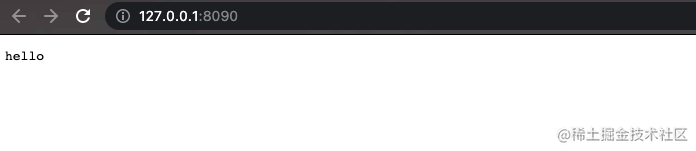
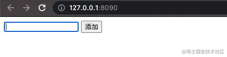
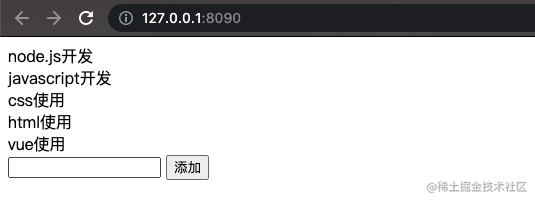
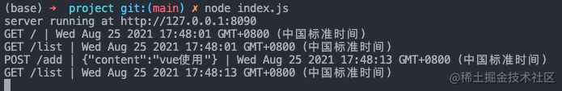

## 后端服务

首先，Node.js的http模块支持创建一个服务器，我们使用它来进行服务器的初始化如下

```js
const http = require('http');

const host = '127.0.0.1';
const port = '8090';

http.createServer((req, res) => {
  console.log(req.url, 'requested at', new Date());
  res.end('hello')
}).listen(port, host, () => {
  console.log(`server running at http://${host}:${port}`);
})
```

随后，使用Node.js执行该文件，我们可以在控制看到`listen`方法中的回调函数的输出如下

```
server running at http://127.0.0.1:8090
```

点击该服务地址，或手动在浏览器内访问该服务地址，会得到我们刚刚创建的服务器返回的hello




并且服务端接收到两个来自客户端（浏览器）的请求，分别为"/"和"/favicon.icon"，这是浏览器的默认行为，同时可以看到服务端在接收到以上两个请求后按照预期，输出了两条请求记录如下

```
/ requested at 2021-08-25T01:16:33.143Z
/favicon.ico requested at 2021-08-25T01:16:33.808Z
```

这就是我们后端服务的雏形，接着我们对其进行优化，做以下两件事情：

1. 对服务根路径'/'请求返回网页index.html
2. 将服务端接收到的请求记录在服务端的日志文件log.json内

如果想做以上两件事，最好的方式是使用Node.js框架进行开发，比如[Express](https://expressjs.com/zh-cn/)或[koa](https://koajs.com/#)，我们这里使用Express进行实现。

### 安装Express

首先，我们通过以下命令在当前项目中增加npm配置，并安装express模块

```
npm init -y
npm install express
```

### 重构服务

接着，我们将原有的Node.js服务改造为Express实现的方式

```js
const express = require('express');
const app = express();

const host = '127.0.0.1';
const port = '8090';

app.get('/', (req, res) => {
  res.end('hello')
})

app.listen(port, host, () => {
  console.log(`server running at http://${host}:${port}`);
})
```

我们引入的express模块，其本身也是一个函数，执行这个函数会返回一个服务器实例，这个实例你可以简单理解为是对Node.js中http模块的封装。

可以看到它也有listen方法，并且同样可以传入服务监听的主机地址和端口，并且拥有同样的监听回调函数。并且该实例还具备get方法可以接收来自客户端的请求，并给出对应的反馈。

### 返回网页

使用Express的优势在这里就可以体现出来，因为Node.js的http所创建的服务器只可以直接返回数据，而经过Express实现的服务器实例对象，可以直接返回文件。我们使用该能力来对根路径请求返回网页文件如下

```js
app.get('/', (req, res) => {
  res.sendFile('./index.html')
})
```

但这样控制台会报以下错误

```
server running at http://127.0.0.1:8090
TypeError: path must be absolute or specify root to res.sendFile
```

这就是告诉我们，使用sendFile方法，必须要使用绝对路径指定文件，或者声明sendFile方法返回文件的基准路径。因此我们可以任选其一方式进行文件返回，两种方式的使用如下

```js
const path = require('path');
const htmlRoot = path.resolve(__dirname, 'index.html')
res.sendFile(htmlRoot)
```

```js
res.sendFile('index.html', {
    root: '.'
})
```

前端网页我们使用CDN版的Vue.js进行页面的快速搭建，如下

```html
<!DOCTYPE html>
<html lang="en">
<head>
  <meta charset="UTF-8">
  <meta http-equiv="X-UA-Compatible" content="IE=edge">
  <meta name="viewport" content="width=device-width, initial-scale=1.0">
  <title>Document</title>
  <script src="https://unpkg.com/vue"></script>
</head>
<body>
  <div id="app">
    {{message}}
  </div>
  <script>
    var app = new Vue({
      el: '#app',
      data: {
        message: 'Hello Vue!'
      }
    })
  </script>
</body>
</html>
```

至此，我们便实现了后端服务返回前端页面的功能，效果如下


### 记录日志

目前我们只是能够将每个请求输出在服务端控制台，但一旦我们的服务终止，或者控制台清空，历史的请求记录就访问不到了，因此我们可以利用Node.js的文件读写能力（详见[Node.js 开发必备基础知识](../2021-08-25-nodejs-basic/)一文）来将每一条请求记录存储在服务端的文件内。

核心实现逻辑如下

```js
function log(msg) {
  const logMsg = msg + '\n';
  const logPath = `./${logName}`;
  const existLog = fs.existsSync(logName);
  if (existLog) {
    fs.appendFileSync(logPath, logMsg);
  } else {
    fs.createWriteStream(logPath).write(logMsg);
  }
}
```

我们这里会先判断服务器是否已经存在日志文件，如果存在，我们只需向日志文件追加记录即可，如果不存在，那么我们就创建一个写数据流，将记录写入日志文件。

这个操作会创建一个日志文件，这样下次启动服务器时如果读取到已有的日志文件则会直接向该文件写入内容即可。

对于“日志记录”函数的使用我们只需要在需要的地方调用即可

```js
app.get('/', (req, res) => {
  const logMsg = `${req.url} requested at, ${new Date()}`
  console.log(logMsg);
  
  log(logMsg);

  res.sendFile('index.html', {
    root: '.'
  });
})
```

这样，我们就实现了记录日志的功能。

## 前端页面

### 页面提交数据

接着，我们在前端页面实现一些基本的常用功能，比如新增备忘，核心逻辑如下

```html
<div id="app">
<div class="history">
  <div class="history-item" v-for="(item, index) of history" :key="index">{{item}}</div>
</div>
<div clas="item-add-wrap">
  <input v-model="newItem" type="text">
  <button @click="add">添加</button>
</div>
</div>
<script>
var app = new Vue({
  el: '#app',
  data: {
    history: [],
    newItem: ''
  },
  methods: {
    add() {
      const api = 'http://127.0.0.1:8090/add';
      const params = {
        content: this.newItem
      }
      const option = {
        method: 'POST',
        body: JSON.stringify(params),
        headers: new Headers({
          'Content-Type': 'application/json'
        })
      }
      console.log('option', option)
      fetch(api, option).then(res => {
        if (res && res.status === 200) {
          console.log('res', res)
        }
      })
    }
  }
})
</script>
```

我们这里使用浏览器自带的`fetch`方法进行网络数据请求，其中第一个参数为要请求的`接口地址`，第二个参数为网络请求的基础配置，比如这里我们声明了请求体格式为`JSON`，并且发送`POST`请求，参数为一个`JSON字符串`。页面显示如下




### 后端接收数据

随后我们需要在后端服务增加对`add`方法的处理如下

```js
app.use(express.json());

function storeData(content, callback) {
  const data = content + '\n';
  const existed = fs.existsSync(dataName);
  const dataPath = `./${dataName}`;
  if (existed) {
    fs.appendFileSync(dataPath, data);
  } else {
    fs.createWriteStream(dataPath).write(data);
  }
  callback();
}

app.post('/add', (req, res) => {
  const params = req.body;
  const logMsg = `POST ${req.url} | ${JSON.stringify(params)} | ${new Date()}`
  console.log(logMsg);

  log(logMsg);

  if (params) {
    const { content = '' } = params;
    if (content) {
      storeData(content, function() {
        res.json({
          errno: 0,
          data: null
        })
      })
    } else {
      res.json({
        errno: 400,
        errmsg: '内容为空'
      })
    }
  }
})
```

其中第一行我们使用express内置的中间件函数对网络请求中的参数进行`JSON化`处理，这样方便我们在`post`方法的请求体中成功解析出页面传递来的JSON参数。

另外，我们定义了storeData函数用于将页面提交的数据存储到服务端的文件内，这个过程是在对数据进行`持久化`存储。

最后，我们使用服务器实例监听post方法，根据指定的API名称`add`，我们接收到来自页面的请求，并且可以对传递而来的数据做处理以及响应返回。

### 页面查询数据

既然我们已经可以通过页面向服务端存储数据，那么接下来我们需要在页面内增加从服务端读取已有数据的能力，实现如下

```js
var app = new Vue({
  el: '#app',
  data: {
    history: [],
    newItem: ''
  },
  created() {
    this.getData();
  },
  methods: {
    add() {
      const api = 'http://127.0.0.1:8090/add';
      const params = {
        content: this.newItem
      }
      const option = {
        method: 'POST',
        body: JSON.stringify(params),
        headers: new Headers({
          'Content-Type': 'application/json'
        })
      }
      fetch(api, option).then(res => {
        if (res && res.status === 200) {
          res.json().then(jsonRes => {
            if (jsonRes.errno === 0) {
              this.getData();
              this.newItem = '';
            }
          })
        }
      })
    },
    getData() {
      fetch('http://127.0.0.1:8090/list').then(res => {
        if (res && res.status === 200) {
          res.json().then(jsonRes => {
            if (jsonRes.errno === 0 && jsonRes.data) {
              this.history = jsonRes.data;
            }
          })
        }
      })
    }
  }
})
```

### 服务端响应数据查询

```js
function readData(callback) {
  const dataPath = `./${dataName}`;
  const existed = fs.existsSync(dataPath);
  let result;
  if (existed) {
    const content = fs.readFileSync(dataPath);
    result = content.toString();
  }
  callback(result);
}

app.get('/list', (req, res) => {
  const logMsg = `GET ${req.url} | ${new Date()}`
  console.log(logMsg);
  
  log(logMsg);

  readData(data => {
    if (data) {
      const jsonData = data.split('\n').filter(str => str.length);
      res.json({
        errno: 0,
        data: jsonData
      })
    } else {
      res.json({
        errno: 400,
        errmsg: '没有内容'
      })
    }
  })
})
```

至此，我们完成了页面从服务端读取数据的能力，并且优化了新添加内容后的交互，即新读取最新内容和清空输入框。整体效果如下：

客户端展示



服务端展示




## 总结

这样我们就基于Node.js为核心开发了一个可以查询服务器数据，并且能向服务器新增数据的完整应用，其中核心利用了Node.js的文件读写能力以及成熟的Node.js框架——Express。真正的Web应用或许还有以下工作需要完成：

- 服务端增加路由中间件
- 服务端数据持久化方法封装
- 服务端日志中间件封装
- 前端网络请求方法封装
- 前端页面增加路由中间件
- ...

而这一切都基于我们本例中实现的基本雏形，所以如果你想开始使用Node.js进行项目开发，可以按照本示例进行逐步实现并继续完善。

> 本文原发布于 [掘金](https://juejin.cn/post/7000303653940641828)