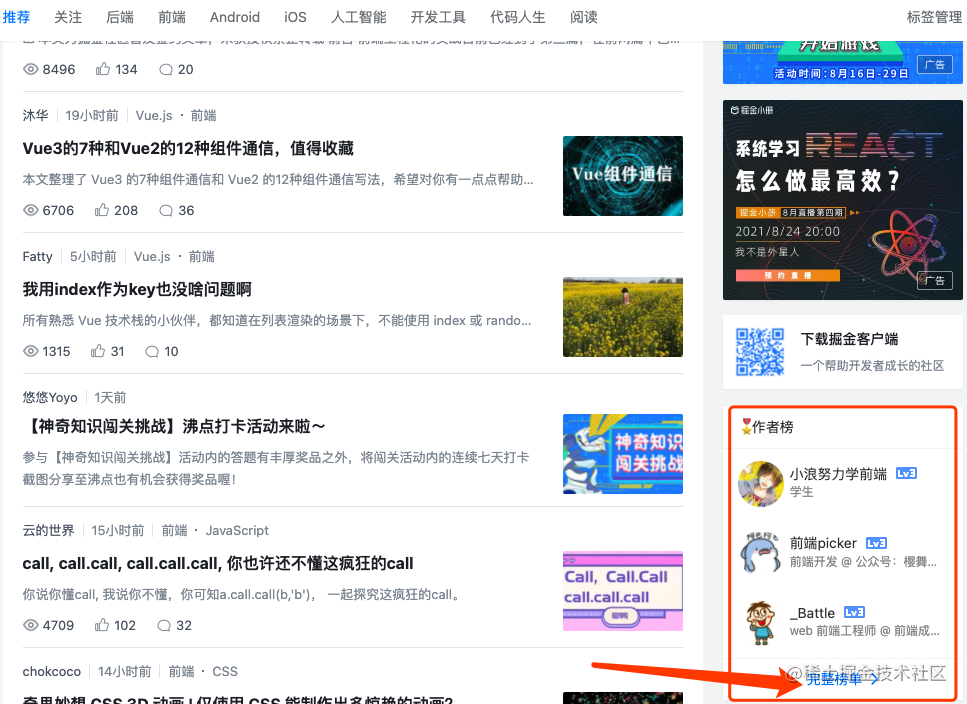
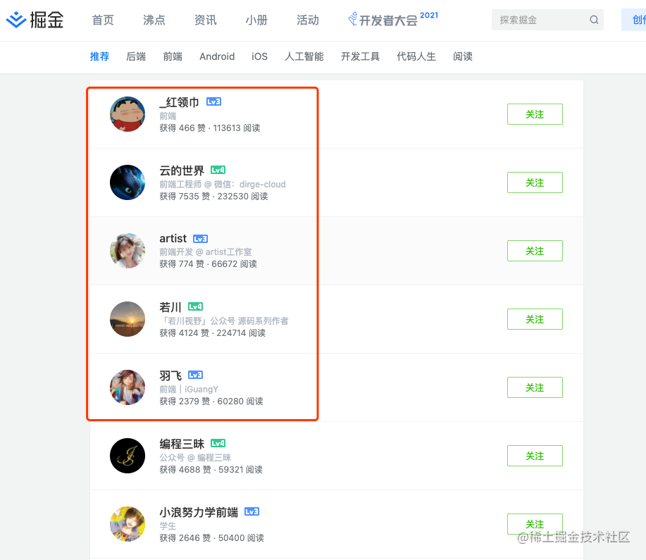
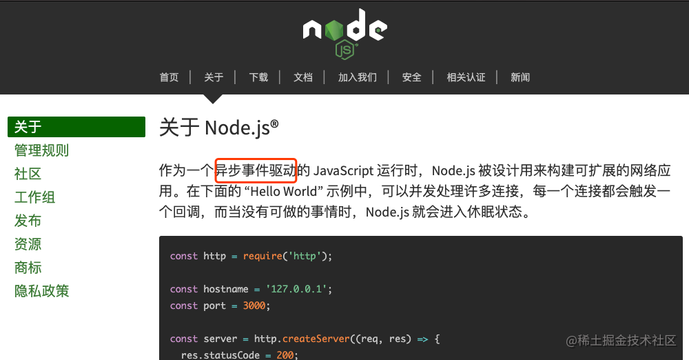

## 综述

开门见山，先说结论：

- 文件读写
- 网络请求
- 回调函数

这三点绝对是使用Node.js进行开发的三项核心必备基础知识，接下来我们来逐一介绍这三点为什么是最基础的核心知识。

## 整体认知

首先要搞清楚`Node.js`是什么，它为什么叫“运行时”。可以这样理解，`JavaScript`是一种编程语言，使用JavaScript编写的代码需要某个环境来运行它。

JavaScript最初被创造出来，是为了在浏览器内执行一些简单的逻辑，实现一些网页调整的功能。所以那时候JavaScript是运行在`浏览器`所提供的执行环境内进行执行的，也就是浏览器这个程序内部拥有可以执行JavaScript的东西，你可以叫它`编译器`，也可以叫它为`解释器`，因此浏览器内可以运行由JavaScript编写的代码逻辑。

后来人们发现JavaScript的语法很友好，容易掌握，因此使用它的语法创造了`Node.js`，这同样是一个可以运行`JavaScript`代码的`环境`，并且它还支持你通过使用JavaScript代码访问`操作系统`的`文件`和`网络资源`。

## 概念详解

### 文件读写

这个很好理解，Node.js相当于一门功能强大的编程语言，它可以访问和操作计算机内的各种资源，比如计算机内存、进程、文件等。

前提就是在某台计算机安装Node.js，并通过Node.js语法编写代码。下载可以通过[这里](https://nodejs.org/zh-cn/download/)，编写代码只需要你按照JavaScript的编程习惯进行使用即可。只不过在浏览器内的JavaScript可以访问浏览器所提供的`API`，比如window.alert()、console.log()等。

Node.js同样有其环境所提供的一系列API。只不过有些API是和浏览器一样存放在`全局对象`上的，而另外很大一部分则是封装在一个个`模块`内部的。

就比如关于`文件读写`的API，你需要在代码内通过引入`fs`模块来进行使用，fs是“File System，文件系统”的含义。

假如我们有一个readme.md文件，内容如下

```md
# 标题一
```

我们可以使用如下代码来读取这个文件的内容

```js
const fs = require('fs');

const file = fs.readFileSync('./readme.md');
console.log(file.toString())
```

输出

```
# 标题一
```

同样，我们可以使用相应的API进行写文件操作，如下

```js
const fs = require('fs');

fs.writeFileSync('./out.md', '# out')
```

会发现当前目录下多了个out.md文件，内容如下

```md
# out
```

### 网络请求

仅仅能够访问`本地文件`是远远不够的，我们还需要利用网络的能力来访问网络上的内容。对于浏览器来说，由于[同源策略](https://developer.mozilla.org/zh-CN/docs/Web/Security/Same-origin_policy)的存在，其网络资源访问能力有限，而在Node.js中，我们则可以使用`http`和`https`模块进行各种网络资源的获取。

例如我们创建如下这样一个Node.js文件

```js
const https = require('https');

const api = 'https://api.juejin.cn/user_api/v1/author/recommend?limit=5'

https.get(api, res => {
  let content = '';
  res.on('data', chunk => {
    content += chunk;
  })
  res.on('end', () => {
    console.log(JSON.parse(content));
  })
})
```

会输出掘金首页的五个推荐用户，如下

```js
{
  err_no: 0,
  err_msg: 'success',
  data: [
    {
      user_id: '4388906148312295',
      user_name: '_红领巾',
      got_digg_count: 466,
      got_view_count: 113613,
      avatar_large: 'https://sf6-ttcdn-tos.pstatp.com/img/user-avatar/20d58b6931ec0610487b6be50ff91aaa~300x300.image',
      company: '',
      job_title: '前端',
      level: 3,
      description: '',
      author_desc: '',
      isfollowed: false
    },
    {
      user_id: '131597122679661',
      user_name: '云的世界',
      got_digg_count: 7535,
      got_view_count: 232528,
      avatar_large: 'https://sf1-ttcdn-tos.pstatp.com/img/user-avatar/f1a9f122e925aeef5e4534ff7f706729~300x300.image',
      company: '微信：dirge-cloud',
      job_title: '前端工程师',
      level: 4,
      description: '看世界，听世界，问世界。',
      author_desc: '',
      isfollowed: false
    },
    {
      user_id: '3298190614865997',
      user_name: 'artist',
      got_digg_count: 774,
      got_view_count: 66671,
      avatar_large: 'https://sf6-ttcdn-tos.pstatp.com/img/user-avatar/84361adb9ca86b8f149ba57b16bbe56c~300x300.image',
      company: 'artist工作室',
      job_title: '前端开发',
      level: 3,
      description: '',
      author_desc: '',
      isfollowed: false
    },
    {
      user_id: '1415826704971918',
      user_name: '若川',
      got_digg_count: 4124,
      got_view_count: 224713,
      avatar_large: 'https://p1-jj.byteimg.com/tos-cn-i-t2oaga2asx/gold-user-assets/2019/6/2/16b17bc6f37d2e4e~tplv-t2oaga2asx-image.image',
      company: '',
      job_title: '「若川视野」公众号 源码系列作者',
      level: 4,
      description: '',
      author_desc: '',
      isfollowed: false
    },
    {
      user_id: '2365804752407480',
      user_name: '羽飞',
      got_digg_count: 2379,
      got_view_count: 60277,
      avatar_large: 'https://sf1-ttcdn-tos.pstatp.com/img/user-avatar/54a24fe455719e158f4ab41863399272~300x300.image',
      company: '',
      job_title: '前端｜iGuangY',
      level: 3,
      description: '跟问题处得久一点',
      author_desc: '',
      isfollowed: false
    }
  ],
  cursor: '5',
  count: 99,
  has_more: true
}
```

这其实就是[掘金首页](https://juejin.cn/)右侧显示的“作者榜”的数据来源，可以点击“完整榜单”进行查看







是不是很神奇呢，不过也不是所有的接口数据我们都能拿到，一般重要的数据接口会采取一些措施，使我们不会这样轻易就访问到结果，但这已经展示了Node.js通过网络模块进行网络资源获取的强大之处。

### 回调函数

接下来，需要解释一下“回调函数”这个东西，因为在Node.js的设计中，充满了回调函数的使用。其[官方文档](https://nodejs.org/zh-cn/about/)中的介绍就提到了Node.js是一个“异步事件驱动”的JavaScript运行时，而回调函数则是JavaScript实现“异步”最基础的方法。



首先我们需要知道，回调函数也是`函数`，只不过它用于“回调执行”。我们拆开来理解，函数就是使用JavaScript声明的代码块，用于执行某些特定的逻辑，声明方式有以下两种

```js
function a (msg) {
    console.log(msg);
}

a('hello');
```

```js
var b = function (msg) {
    console.log(msg);
}

b('world');
```

其中第一种叫做`函数声明`，后者叫做`函数表达式`。

声明就是使用`function`关键字声明变量a为某个函数，后续使用这个变量a进行函数的调用。表达式则是编程语言中的一种基本运算操作，就像声明一个普通变量一样，函数表达式将一个函数赋值给一个变量，这个变量的内容就是函数，所以调用这个函数也就是使用该变量再加上括号来执行。

而“回调”这个概念是因为JavaScript可以将一个函数作为另一个函数的`参数`，就像下面代码所示

```js
function a (callback) {
    const msg = 'hello';
    callback(msg);
}

function b (msg) {
    console.log(msg);
}

a(b);
```

这里声明了两个函数，函数a的参数在接收另一个函数，其内部执行逻辑为“先赋值一个值为hello的变量msg，然后将msg作为参数，执行参数传入的函数”。而函数b的逻辑则为单纯地输出传入的变量值。

当执行函数a时，我们把函数b作为参数传入函数a，这样在函数a内部执行到callback(msg)的逻辑时即可以称作“回调函数执行”，而这里的callback则被称为“回调函数”。

理解了回调函数的概念，我们再来看网络请求中的示例

```js
const https = require('https');

const api = 'https://api.juejin.cn/user_api/v1/author/recommend?limit=5'

https.get(api, res => {
  let content = '';
  res.on('data', chunk => {
    content += chunk;
  })
  res.on('end', () => {
    console.log(JSON.parse(content));
  })
})
```

其中的`https.get`就是在调用https模块中的get方法（方法是在某种意义上函数的别称），我们传给get函数的参数分别是api和另一个函数，其中api是一个普通变量，其内容为某个网络资源地址，而另一个函数我们则是我们的`回调函数`。

我们可以将其单独写出来

```js
const https = require('https');

const api = 'https://api.juejin.cn/user_api/v1/author/recommend?limit=5'

function callback (res) {
    let content = '';
    res.on('data', chunk => {
        content += chunk;
    })
    res.on('end', () => {
        console.log(JSON.parse(content));
    })
}

https.get(api, callback);
```

这样看会更像我们上面举的例子，这里的https.get则是我们上面的a函数，而callback则是我们的b函数。这是这里使用回调函数的第一处，同样，在res.on('data')中的第二个参数是第二处使用回调函数，在res.on('end')的第二个参数是第三处使用回调函数。

Node.js中大多数API都是类似上面这样进行使用，因此可见，掌握回调函数是Node.js的核心基础之一。当然，如今Node.js经过不断发展，也产生了其他方式处理异步操作，不过回调函数仍是其最基础的实现方式。

## 总结

总结一下，本文我们学习了`文件读写`、`网络请求`和`回调函数`三个基础的核心概念，这既是进行Node.js开发的必备基础知识，同样也是很多其他编程语言的核心知识。所以掌握好这些概念的理解对于学习软件开发来说至关重要。

而且，在掌握了这三点以后，你基本已经可以使用Node.js的大部分功能了，更多的功能可能是在这三者的各种组合之上，并配合其他基本能力进行完成。如果你对Node.js开发感兴趣，那么就赶紧安装一个Node.js，并开始你的编程之旅吧。

> 本文原发布于 [掘金](https://juejin.cn/post/7000032048337387527)