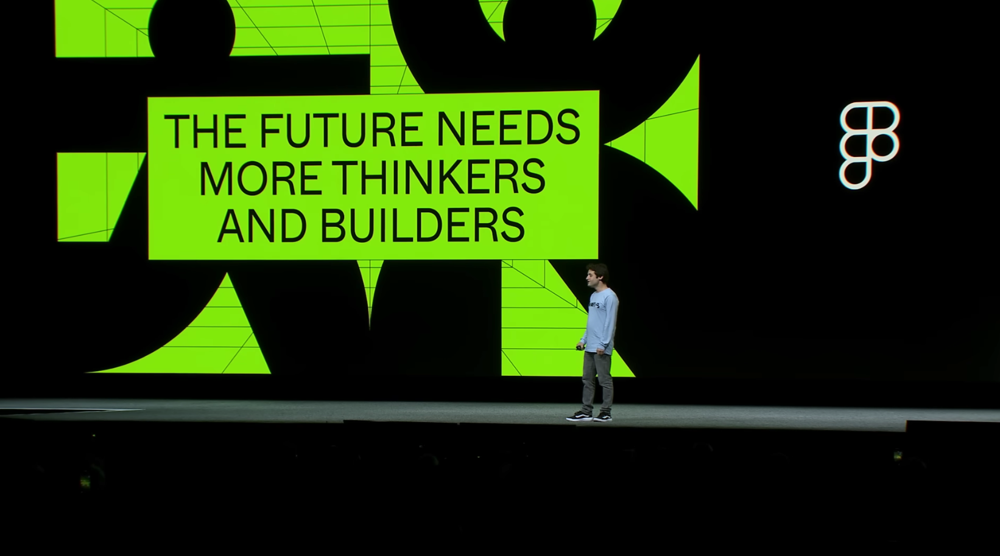
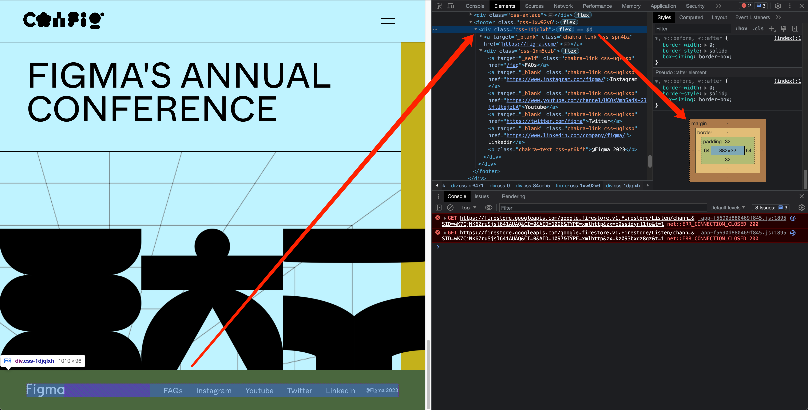
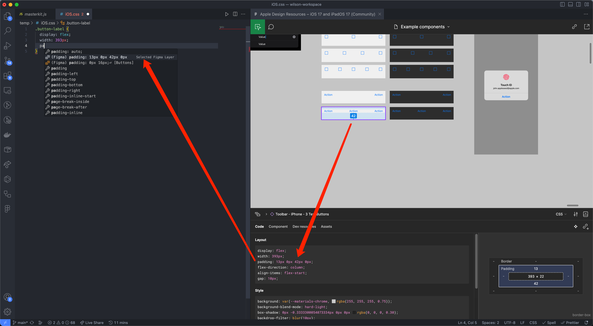
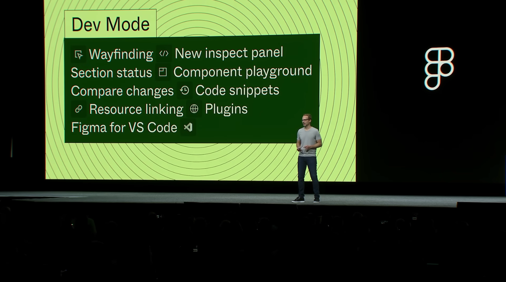

关于 Figma Config 2023 后半部分“开发模式”演讲的总结

<!--more-->

## Ready for dev

解决痛点：开发找错设计稿

以往是如何解决的？在页面名称上标清哪些是草稿，哪些是定稿的，这里的”定稿“也就是所谓的”ready for dev，准备好用于开发“。

开发模式下页面默认仅展示准备就绪的设计稿，其他未就绪的页面默认收起，这里突现了”保持简洁，仅展示必要的信息“的原则，也是一款优秀软件应该遵守的设计原则。

## 变更对比

### 功能价值

作为开发，最先想到的就是`code diff`。因为在实际生产中，每个变更都应该是小心翼翼的，因此当你变更一段代码时，理应通过`diff`工具对改动前后的代码进行逐行确认，确保你的这次变更足够合理。

### 相似功能

其实`变更对比`这件事如今已经被应用到很多场景了，比如 jira 文档更新的版本对比、云文档的变更记录等，能够使用对比工具直观看出一次改动所带来的`具体差异`，对于`操作者`来说是能够使其更加坚定进行保存的信心来源。

### 功能分析

figma 这次做的是对一个文件进行两个版本的左右对比，形式有点像”找不同“游戏。但对于图片的差异比较，基本也只能做到这个程度。然而真的仅此而已吗？当然不，figma 总能给人惊喜。它还提供将两个版本进行重叠的方式进行差异对比，因为图片是二维内容，左右对比对于一维的文本内容来说可能足够，但对于图片的差异对比如果要依赖人的肉眼去”找不同“，还是有点费力的。

此次对于版本对比体验的提升，像极了 [上篇](/wilson-blog/2023/07/02/figma-config-2023/) 中提到的*原型同屏预览*，同样是对既有功能的体验提升。就版本对比来说，相比原本的历史版本切换，实在进步了不少，因为比起完整查看新的版本或历史版本，人眼对于细微差异往往是难以察觉的，因此原本的历史版本功能显得并不实用。

此外，figma 更进一步，既然两个版本的差异已经能够呈现在页面上，那么应用本身一定是具有两个版本之间差异的完整信息，那么何不直接把这些信息暴露给用户呢，这个场景的用户即是开发者，开发者最希望看到更多的细节。

差异信息体现在图层属性的新增、修改和删除，这些变化仿佛就在扮演着以往协作场景中设计师角色，以往设计师可能需要亲自口头告知或通过额外维护一个文档来传达 TA 最新发生的修改具体是什么。

### 功能延伸

“寻找差异”这种方式无论放在哪个领域，往往都是更高效的对比方式。

这里举一些运用”差异“思维的应用实例，比如云计算的基础是在云端存储大量数据，而对于同一份数据，可能每时每刻都在发生变化，如果想全量存储这些数据在不同时间的状态几乎是不可想象的成本。因此早在云计算诞生之初，人们就想出”差量“备份的思路，对于数据不同时间的存储，仅存储其和相邻前一个版本之间的差异，然后在调取历史版本时，通过当前版本以及此前发生过的所有变更来计算出原始的状态。这样虽然牺牲了一点历史版本查看的性能，但却节省了大量的存储空间去存放那些相同的数据。

那么既然谈到云存储，自然可以想到 MacOS 的*时间机器*功能，它可以为你保存电脑数据在某一时刻的”快照“，当你想让电脑恢复至某一个历史时刻，你就可以像搭乘”时间机器“一样回到过去的某个时刻。这个功能显然也会利用”差量备份“的方式进行历史版本存储，否则你的时间机器对于电脑的磁盘占用将会是*版本数*乘以*某一个时刻的存储占用*那么多。

还有最经典的 Git 工具，它是用于管理代码历史版本的工具，记录着开发者每一次提交记录的差异，从而可以回看所有的历史提交。这样仅仅通过记录每次的改动差异就能形成一个代码仓库的完整历史，不得不说”差异对比“思想绝对算得上是存储算法中的核心基石。

那么回到 figma 这款设计工具，其实从这次上线的版本对比功能来看，figma 大概率之前也是对文件历史版本进行”差异“保存的，只是直到现在才把这个原本用于开发实践的思想搬到用户眼前。

## 图层检查增强

这个改动对于开发者来说确实更加深入人心，因为前端工程师往往对于一个在浏览器中访问的 web 应用进行调试时，通过工具看到的也会是所有图层在同一层（当然也有例外，比如绝对布局会在垂直轴上产生新的的”层“）。但大多时候，我们调试网页时看到的是如下的效果

虽然在实际的 HTML 中，元素是一层一层的，但当元素被渲染成页面时，内容仍然是一块一块的。因此当我们调试每块内容的`样式属性`时，我们并不希望发现它们竟然有层的关系，甚至我们还需要通过*双击*某一层来进到”下一层“，因为单击某个图层在设计模式下将会是”选中图层“的效果。

## 图标导出

这也是之前设计模式下”反效率“的一个点，在线设计工具原始图稿信息丰富虽好，但对于图标导出可能并不友好。如果开发者选中了错误的图标容器，导出的可能会是缺失图层的图标或是包含多余边距的图层。

这些以往对于开发人员造成困扰的多余信息将在开发模式下消失，从此对于图标图层，在开始模式下仅会有一个可选中对象，那就是图标本身。这样的一个细小变化，对于图标、切图这类标准化的交付场景将会是一个 [SOP](https://en.wikipedia.org/wiki/Standard_operating_procedure) 级别的提升。

## 元素单位选择

这让我想起了微信小程序开发工具，因为小程序应用不同于 web 应用，web 的运行环境是浏览器，而小程序应用的运行环境是 APP。因此 web 应用内使用的单位是交给浏览器理解的，因此常见的单位是 px、百分比、rem/em 和 vw/vh。但小程序运行时实际在使用手机操作系统的渲染器进行元素绘制，但移动端设备的种类太多，因此小程序需要自定义一套元素单位。

这里 figma 支持了元素大小单位的选择，是拓展了其设计支持能力的边界，因为设计交付的场景既可能是网页，也可能是手机 APP 甚至小程序，能够适应不同应用类别下的单位选择。

## 组件 playground

这像是把 [storybook](https://storybook.js.org/) 的一部分功能搬进了 figma 的弹窗，从此团队对于组件库的维护不再限于设计师单方面创造和维护。开发人员在开始模式下可以共享设计师对于组件信息的管理，这一能力有望打破原本对于组件库这一资产在设计师和前端开发之间的重复劳动。

因为 playground 对于组件实现了不同 token 下的视觉预览，而不再是枯燥无味的组件名。这种对于组件的维护方式可以直接提高前端开发人员在 figma 页面的停留时长，因为从此对于团队资产不再需要另外打开一个网站或者文档去看它的具体参数和信息了。

## 开发资源

这是一个小功能，但也让团队资产管理更加完整，因为在今天，互联网团队对于资产的管理本就是一半在本地一半在云上。在云上的部分可能是各个 web 服务下的组合，比如设计稿存储在 figma 账号中，而组件库代码则是维护在 gitlab 或 github 上。

## 代码片段增强

从前的代码展示在标注模式下，而如今因为有了开发模式，因此代码标注信息将以更加接近开发者的使用方式呈现。比如按照前端开发中的 [BEM](https://en.bem.info/methodology/quick-start/#introduction) 原则，布局、样式和修饰符在 CSS 中应该进行清晰的区分，这样才更有利于构建复杂的 UI，而 figma 显然是懂这一点的。

对于这些细节的改动，每一个单点看起来可能都不起眼，但汇聚在一起，就是对于使用体验的整体升级，让使用者真正感受到工具的“趁手”。

## 开发模式插件

[D2C](https://github.com/topics/design-to-code)是 web 应用发展衍生出的交付形态——design to code，设计图转代码。这在此前被认为是一种理想的交付形态，因为这节省了开发人员还原设计稿的时间，从而可以快速将设计稿直接转换为可部署的网页形态。但随着近几年 web 技术发展的成熟，一些实践使得这项技术成为可能（比如微软之前提出的[sketch2code](https://www.microsoft.com/en-us/ai/ai-lab-sketch2code)，草图生成代码）。

而 figma 将插件功能集成到开发模式下的代码标注区域，是一次将设计稿转代码片段的尝试。因为代码不同于样式信息，使用代码描述组件，可以使得其具有更好的拓展性和复用性。因此如果能够根据设计稿信息给出组件的代码片段，那么后续开发模式就可能发展成 [Low Code](https://en.wikipedia.org/wiki/Low-code_development_platform) 工具。

看似又一个平淡无奇的尝试，实则孕育着更多的可能性和产品形态延展。

> 补充阅读：Anima 是什么？https://www.animaapp.com/

## VS Code 插件

如果你是一名开发者，你才会明白，开发者在工作时并不想离开 IDE 环境。一切能在 IDE 完成的事情，不应切换窗口去到其他地方。因为在开发环节，程序员需要保持聚焦，否则思路可能会被打断。因此，IDE 市场才会有众多插件满足开发者在 IDE 内满足大多事情。

> 详见 VS Code 插件市场：https://marketplace.visualstudio.com/vscode

Figma 做了相应的 VS Code 插件，可见它是尊重开发者使用习惯的，如果能在 IDE 内访问 Figma 文件，何乐而不为呢？更何况 IDE 不仅是开发工具，也可以是基本的文件编辑器，当使用 VS Code 管理自己的 Figma 文件时，仿佛就像是在本地文件夹管理你的设计文件，并且它还是支持查看设计文件中的标注信息，这是基于 VS Code 支持直接在其内部打开 web 应用的能力，就像使用浏览器一样。

另外，[Figma for VS Code](https://marketplace.visualstudio.com/items?itemName=figma.figma-vscode-extension) 还支持在代码编辑时提示当前文件页选中的图层样式，从而实现一键代码填充。这样的开发体验非常接近现有的编程辅助工具，比如 [tabnine](https://www.tabnine.com/) 和 [copilot](https://github.com/features/copilot)，但这类工具大多依赖 AI 进行代码提示，也就是它们提供的虽然是可用代码，但并不是符合团队共用的“标准代码”。而 Figma 的样式提示能力则大概率是通过 [Typescript](https://www.typescriptlang.org/) 的类型推导能力实现的组件样式映射，也就是对于同样的样式属性，所有人提示的代码均是与设计稿严格保持一致的标准代码。

# 小结

开发模式的诞生，意味着 figma 将“一人分饰两角”，在同一款软件内实现两种生产角色的同等使用体验。而做到这一点的推动力是因为 figma 的用户画像——设计师与开发者用户量 1:1，这样来看，figma 推出开发模式既艰难又合理，但对于同类软件却是一个值得慎重考虑的事情，因为并不是所有软件都具备同样的痛点。

