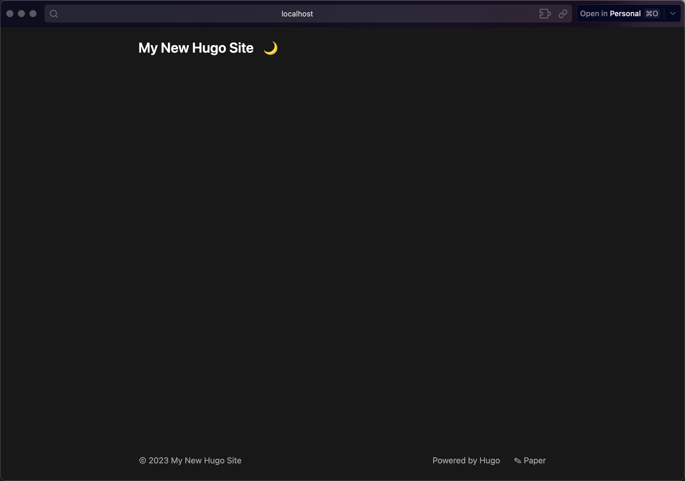

> 接[上篇](../2023-11-26-hugo-blog-1)

环境准备好以后的使用还是比较简单的，我准备直接在原本基于 hexo 的博客项目中进行，因为想保留原先仓库的 git 提交记录。

但是发现 [hugo 使用文档](https://gohugo.io/getting-started/quick-start/#create-a-site) 中并没有介绍在已有项目中初始化的方式，因此先建了一个新的站点，看下目录结构和配置文件和 hexo 有什么异同。

## 目录结构

首先使用 [tree](https://www.geeksforgeeks.org/tree-command-unixlinux/) 命令看下 hugo 生成的目录结构

```
.
├── archetypes
│   └── default.md
├── assets
├── content
├── data
├── hugo.toml
├── i18n
├── layouts
├── static
└── themes

8 directories, 2 files
```

## 主题选择

通过上面的命令初始化了 hugo 工程，但其实还没什么主要文件。

因为整个 hugo 站点的内容是基于主题进行搭建的，可以在网上寻找适合自己的主题，官网提供了 300+个 [主题](https://themes.gohugo.io/)

这里我选择了 [PaperMod](https://github.com/adityatelange/hugo-PaperMod/) 这个主题，这是一个基于 [Paper](https://github.com/nanxiaobei/hugo-paper) 拓展的一个主题，相比 Paper 丰富了更多功能（一开始我尝试的是 Paper，发现很简洁，但是太简洁了）

这里我选择将主题项目作为 git 子模块集成到项目的方式，在 hugo 工程的目录下载主题文件后，在主配置文件内设置 theme 配置项，然后就可以启动项目了

```
git submodule add https://github.com/nanxiaobei/hugo-paper themes/paper
```

## 项目启动

```
hugo server
```

```
hugo server
Watching for changes in /Users/xxx/xxx/{archetypes,assets,content,data,i18n,layouts,static,themes}
Watching for config changes in /Users/xxx/xxx/hugo.toml
Start building sites …
hugo v0.120.4+extended darwin/arm64 BuildDate=unknown


                   | EN
-------------------+-----
  Pages            |  7
  Paginator pages  |  0
  Non-page files   |  0
  Static files     | 11
  Processed images |  0
  Aliases          |  3
  Sitemaps         |  1
  Cleaned          |  0

Built in 17 ms
Environment: "development"
Serving pages from memory
Running in Fast Render Mode. For full rebuilds on change: hugo server --disableFastRender
Web Server is available at http://localhost:1313/ (bind address 127.0.0.1)
Press Ctrl+C to stop

```

可见 hugo 是启动了一个静态站点的服务将内容渲染到网页上，并且支持内容文件和配置文件修改的热更新



> 这是一开始使用 Paper 截的图

## 新建内容

```
hugo new content posts/xxx.md
```

这应该是最常用的命令，即新建一篇内容。

执行后会根据输入的 md 文件名在 posts 目录新建对应的 md 文件，并且预设一些配置

```
+++
title = 'Use Hugo to Make a Blog Site'
date = 2023-11-26T23:30:59+08:00
draft = true
+++
```

这里的 draft = true 表示新创建的文件默认为 `草稿` 状态，草稿内容不会被发布到站点的预览。

> 更多关于 hugo 内容状态的设计可查看 https://gohugo.io/getting-started/usage/#draft-future-and-expired-content

如果想让本地启动的预览服务能够展示草稿的内容，需要使用 `hugo server -D`（即 hugo server --buildDrafts）来运行本地服务。

## 发布站点

发布的命令很简单，就是一个`hugo`，它会根据配置文件将内容发布成最终的站点目录 public，里面包含的内容就是组成站点的 HTML、CSS 和 JavaScript 文件。

这里的发布其实是 hugo 将 markdown 文件转换成 HTML。所谓发布是指生成发布目录 public，所以 public 目录是在 .gitignore 文件内的。因为真实的发布很少会手动拿着 public 目录去放到服务器目录，而是通过一些 CI/CD 流程在云端进行发布。

> 但 public 里的目录基本就是最终可访问的站点全部内容了，都是一些静态资源，本地也可以直接访问 HTML 来查看

## 远程发布

虽然 public 目录已经是一个可访问的静态站点目录，但是如果想在互联网上可访问，还需要将这个站点目录部署在线上的站点服务器，这样所有人都可以通过站点的 URL 进行访问。

这里我选择使用 GitHub 提供的静态站点部署服务——GitHub Pages，它与 GitHub 仓库深度集成，可以将某个符合静态站点规则的仓库部署在仓库同名的 pages 域名下，并且还可以借助 GitHub Actions 将仓库的更新与站点部署更新集成起来，非常方便。

Hugo 也提供了与 GitHub Pages 集成的方式：https://gohugo.io/hosting-and-deployment/hosting-on-github/

但这个配置感觉有点疏于更新，实际用起来会有些问题，最终我参考网上其他使用者的讨论，找到了最新的配置方式。

> 这就体现出一个相对成熟框架的优势，有足够多的使用者和相对活跃的社区非常重要，这对于新用户遇到问题后能否找到解决方法很有帮助。比如 hugo 有自己的社区[论坛](https://discourse.gohugo.io/)

## 感想

每次折腾博客站点，就感觉像是在装修房子，对于主题的选择和站点内的配置一次次考验着个人的审美以及取舍观。
