对于生活，我一般是通过手机相册帮助自己回忆这一年的生活，因为平时我喜欢随手拿手机记录生活中有意思或有意义的定格。

对于工作，则是通过翻看工作中记录的文档，因为我在工作中一直有写文档的习惯，所以一年之中工作的产出基本都可以围绕文档进行总结。

## 一月

新家装修完成

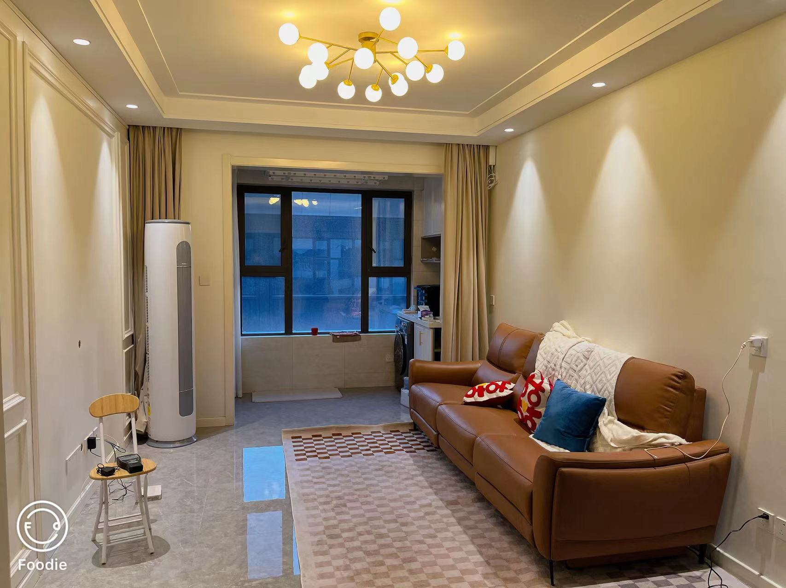

工作上呢？

开玩笑的

2023年的工作内容其实有挺大变化的，要从业务需求开发转到性能架构方向。

其实之前没怎么做过性能或架构相关的事情，基本可以说是零经验，和 leader 1-1 的时候也是坦言之前没有这方面的经验。但有幸碰到伯乐 leader，认为我可以做好，当时也就接下了这个挑战。

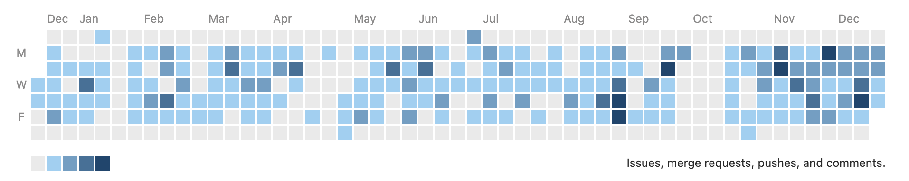

经过一年的努力，现在再回头看，对于“是挑战也是机会”有了更深刻的理解。2023年，应该算技术成长上一个阶段性的跃升吧，但也得益于我始终相信的“厚积才能薄发”。

### 年夜饭

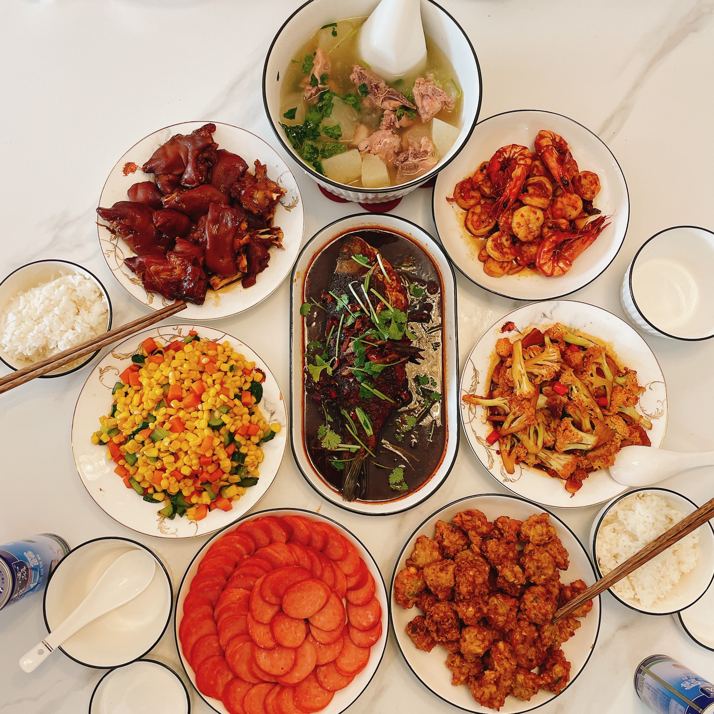

2023年的除夕是1月21号，老婆凭一己之力做了满满一桌的年夜饭👏🏻

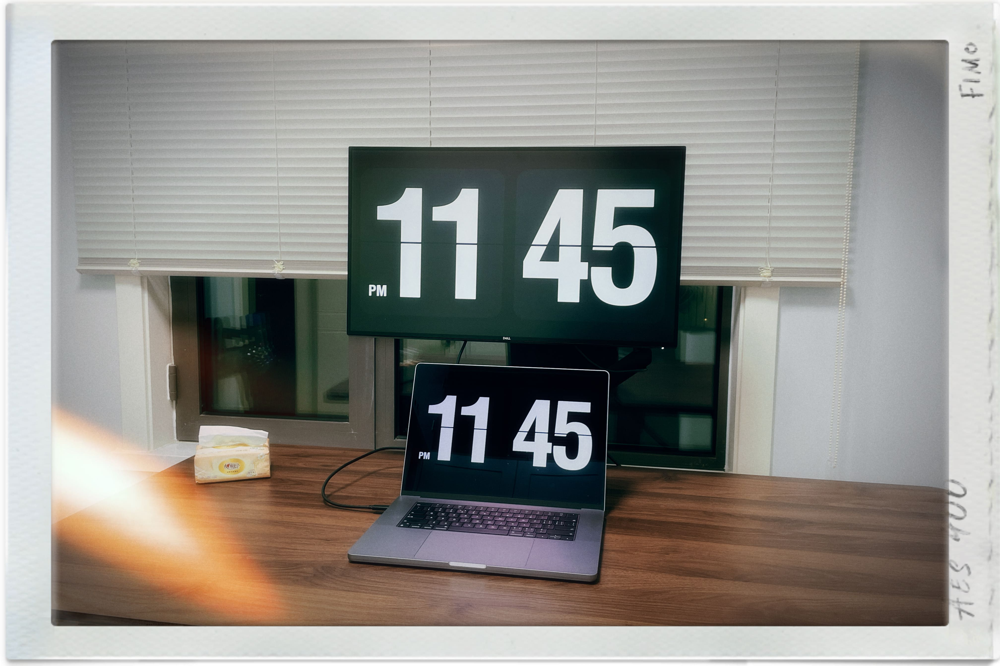

新家书桌也可以投入使用了（虽然假期结束后它就继续在新家吃灰了）

## 二月

准备迎接新生命

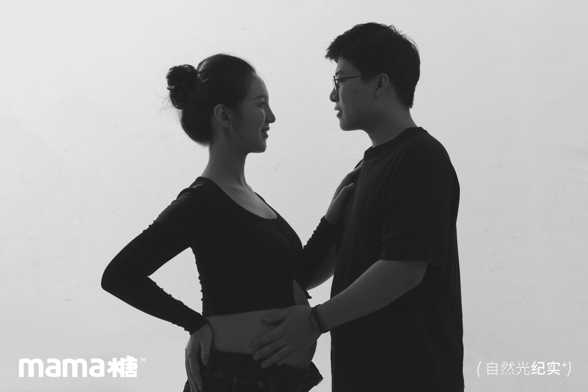

二月陪老婆拍了孕妇照，距离宝宝到来进入倒计时。

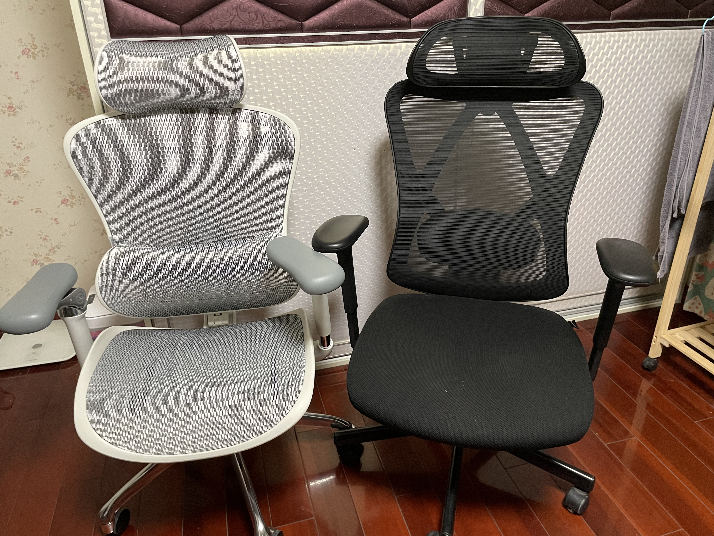

换了把椅子，因为之前住处附近的商场恰好有西昊线下体验店，当时去试了一下感觉很不错。

左侧是新椅子——西昊 [C300](https://www.taobao.com/list/item/674684474576.htm)，右侧去年买的松能 [Y-5B](https://www.taobao.com/list/item/651748355788.htm)

买新椅子的另一个原因是需要放一把在新家，不然书房没椅子。

### core-js 事件

2月底关注了一下 [core-js事件](https://github.com/zloirock/core-js/blob/master/docs/zh_CN/2023-02-14-so-whats-next.md)，再次感慨开源不易，对于社区的开源维护者也有了新的认知。

core-js 的作者好像是一个俄罗斯人，初为人父。他在帖子里诚实地写道“当我开始研究core-js时，我独自一人。现在我有一个家庭了。一年多前，我成了我儿子的父亲。现在我必须为他提供体面的生活水平。”

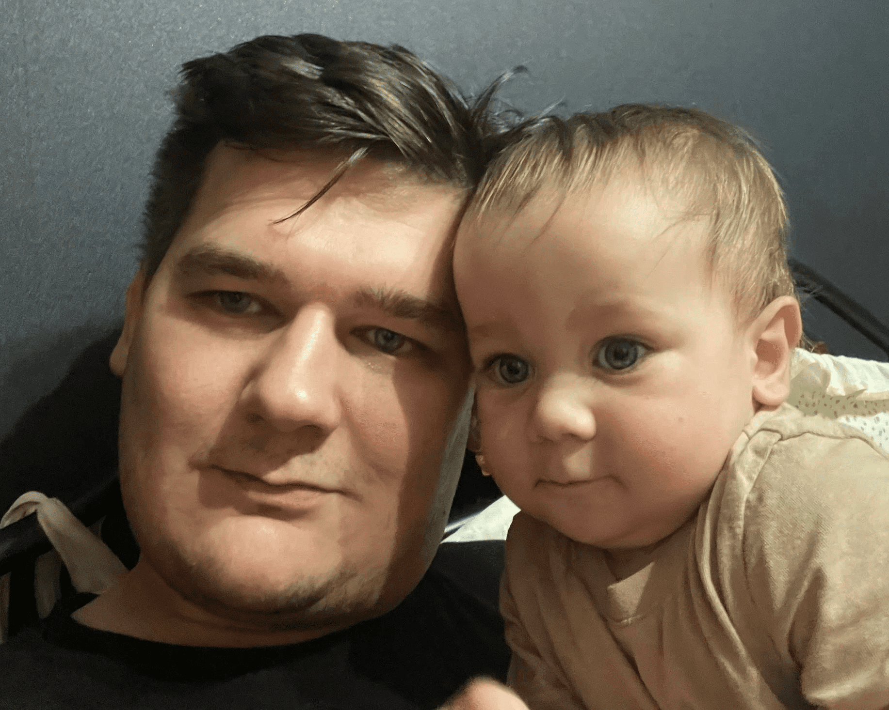

自己也同样即将为人父，希望这笔小小的捐献能够为开源社区出一点微薄之力吧。

### 电视柜

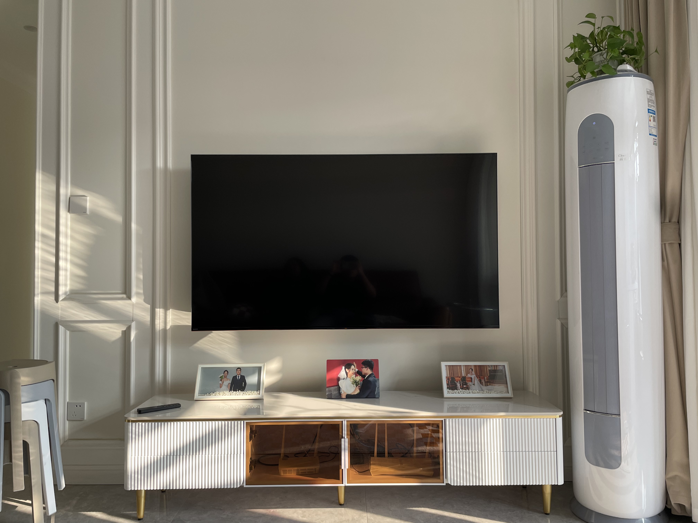

客厅最后两大件——电视、电视柜采购安装完毕👏🏻，春节假期也随之结束了，返京上班。

## 三月

三月是开工月，所以好像没拍什么生活上的照片，只翻到一张公司楼下买咖啡回去路上拍的

## 四月

傍晚的奥林匹克塔

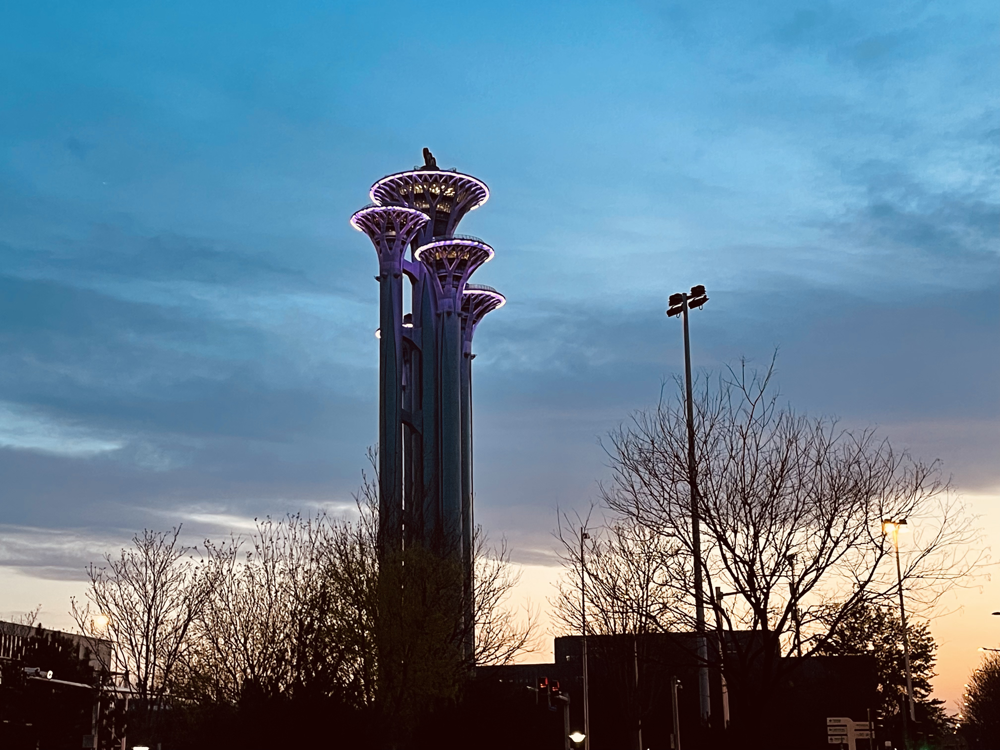

> [知乎-北京奥林匹克公园瞭望塔是干什么用的？](https://www.zhihu.com/question/24239011)

### 迎接新生命

四月的重头戏当然是迎接小孩出生，办好住院手续，陪老婆待产。

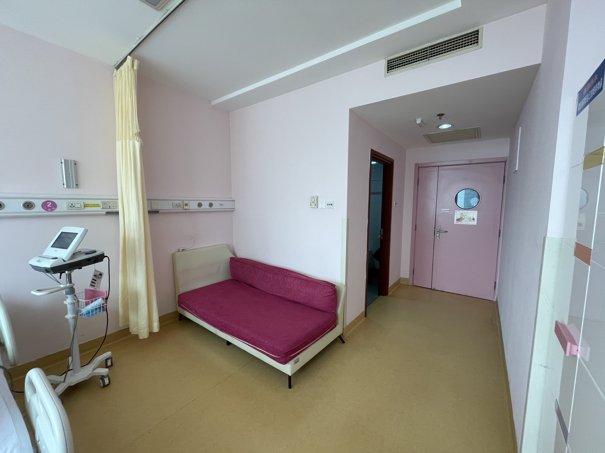

那个玫色的床就是老婆住院期间我睡觉的地方了，病房整体条件还不错。

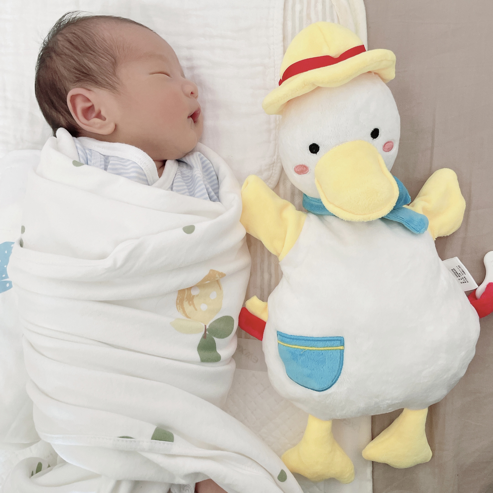

接小家伙出院后的日常就是看他睡觉😴

整个四月份一半时间在休陪产假，技术上关注了今年大火的 [ChatGPT](https://openai.com/blog/chatgpt)，团队核心成员的履历都是顶尖水平，仿佛看到一场新的技术革命正在发生。

## 五月

技术界又一位重量级程序员——[陈皓](https://www.infoq.cn/article/vftzcsaledsmo6fh9zzc)去世，年仅47岁。

他的离去让程序员圈内关于珍惜身体和工作生活平衡的话题又一次掀起波澜，尽管从2022年中开始至今就业市场都在恶化。

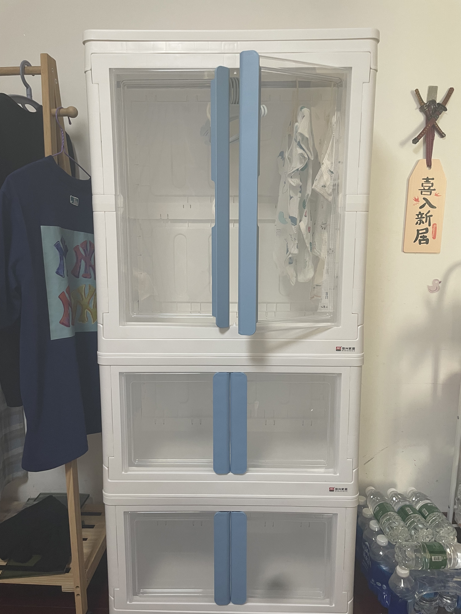

给小家伙买了专属衣柜

--------

五月底的最后一件事就是一个朋友辞职回家创业了，是一位学历、能力都很优秀的同事。虽然刚毕业不久，但决定却很果断，佩服他的勇气，同样也很祝福。

> 愿你出走半生，归来仍是少年😆