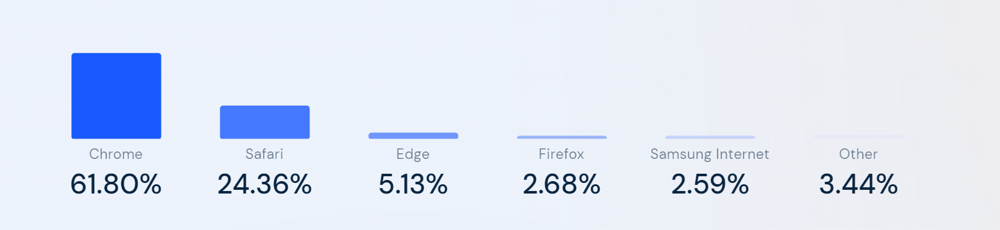

对于生活，我一般是通过手机相册帮助自己回忆这一年的生活，因为平时我喜欢随手拿手机记录生活中有意思或有意义的定格。

对于工作，则是通过翻看工作中记录的文档，因为我在工作中一直有写文档的习惯，所以一年之中工作的产出基本都可以围绕文档进行总结。

## 一月

新家装修完成

工作上呢？

开玩笑的

2023年的工作内容其实有挺大变化的，要从业务需求开发转到性能架构方向。

其实之前没怎么做过性能或架构相关的事情，基本可以说是零经验，和 leader 1-1 的时候也是坦言之前没有这方面的经验。但有幸碰到伯乐 leader，认为我可以做好，当时也就接下了这个挑战。

经过一年的努力，现在再回头看，对于“是挑战也是机会”有了更深刻的理解。2023年，应该算技术成长上一个阶段性的跃升吧，但也得益于我始终相信的“厚积才能薄发”。

### 年夜饭

2023年的除夕是1月21号，老婆凭一己之力做了满满一桌的年夜饭👏🏻

新家书桌也可以投入使用了（虽然假期结束后它就继续在新家吃灰了）

## 二月

准备迎接新生命

二月陪老婆拍了孕妇照，距离宝宝到来进入倒计时。

换了把椅子，因为之前住处附近的商场恰好有西昊线下体验店，当时去试了一下感觉很不错。

左侧是新椅子——西昊 [C300](https://www.taobao.com/list/item/674684474576.htm)，右侧去年买的松能 [Y-5B](https://www.taobao.com/list/item/651748355788.htm)

买新椅子的另一个原因是需要放一把在新家，不然书房没椅子。

### core-js 事件

2月底关注了一下 [core-js事件](https://github.com/zloirock/core-js/blob/master/docs/zh_CN/2023-02-14-so-whats-next.md)，再次感慨开源不易，对于社区的开源维护者也有了新的认知。

core-js 的作者好像是一个俄罗斯人，初为人父。他在帖子里诚恳地写道“当我开始研究core-js时，我独自一人。现在我有一个家庭了。一年多前，我成了我儿子的父亲。现在我必须为他提供体面的生活水平。”

自己也同样即将为人父，希望这笔小小的捐献能够为开源社区出一点微薄之力吧。

### 电视柜

客厅最后两大件——电视、电视柜采购安装完毕👏🏻，春节假期也随之结束了，返京上班。

## 三月

### 开工月

三月是开工月，所以好像没拍什么生活上的照片，只翻到一张公司楼下买咖啡回去路上拍的

## 四月

傍晚的奥林匹克塔

> [知乎-北京奥林匹克公园瞭望塔是干什么用的？](https://www.zhihu.com/question/24239011)

### 迎接新生命

四月的重头戏当然是迎接小孩出生，办好住院手续，陪老婆待产。

> 那个玫色的床就是老婆住院期间我睡觉的地方了，病房整体条件还不错。

接小家伙出院后的日常就是看他睡觉😴

整个四月份一半时间在休陪产假，技术上关注了今年大火的 [ChatGPT](https://openai.com/blog/chatgpt)，团队核心成员的履历都是顶尖水平，仿佛看到一场新的技术革命正在发生。

## 五月

### 又一位程序员离世

2023年5月13日，技术界又一位重量级程序员——陈皓[去世](https://www.infoq.cn/article/vftzcsaledsmo6fh9zzc)，年仅47岁。

> 上一次听到类似的消息是 2020年的 [司徒正美](https://new.qq.com/rain/a/20200331A0SUPX00)，年仅 36 岁。

他的离去让程序员圈内关于珍惜身体和工作生活平衡的话题又一次掀起波澜，尽管从2022年中开始至今就业市场都在恶化。

R.I.P.

--------

五月底的最后一件事是一个朋友辞职回家创业了，是一位学历、能力都很优秀的同事。虽然刚毕业不久，但决定却很果断，佩服他的勇气，同样也很祝福。

> 愿你出走半生，归来仍是少年🙌

## 六月

偶然看到一张图，很受启发。

不是只有周末才是生活，其实每一天都是生活本身。

正如我知乎的签名“时光匆忙，我把每一天都活得不一样”

### 换手机

六月换了新手机——iPhone14 Pro，因为之前用的 iPhone12 从去年年底开始拍照总有小黑点，上班也一直没时间去修，就干脆换了。而且这次直接换 Pro，可以当做家庭相机，记录小孩成长。

关注到 [Figma](https://www.figma.com/about/) 前 CTO [Evan Wallace](https://madebyevan.com/) 准备使用 [JavaScript](https://developer.mozilla.org/en-US/docs/Web/JavaScript) 实现一个用于兼容那些不支持 [WASM](https://webassembly.org/) 的浏览器使用的[库](https://github.com/evanw/polywasm)。

因为 Figma 最早就是利用 WASM 的能力得以让应用的使用性能提高了数倍，从而建立了自己的护城河。

> https://www.figma.com/blog/webassembly-cut-figmas-load-time-by-3x/

同时他还是百万级用户量代码打包工具 [esbuild](https://esbuild.github.io/) 的作者，这样的技术热情确实令人敬佩。🫡

六月还看了JJ在B站的线上演唱会，其实一开始是为了在B站看《古惑仔》，然后开了大会员，结果送了林俊杰线上演唱会的门票。

既然会员开了，所以当然电影该看还得看。

之所以看《古惑仔》是因为之前确实没有完整看过，那段时间偶然八卦到这个系列其实是当年香港影视圈的部分真实写照，因此出于好奇考了古。

偶然在网上看到这样一张图，价值观又一次受到冲击，哈哈。果然人的一生不断提升认知还是很重要的，不然可能会多走一些不必要的弯路。

> 世上无难事，只要肯放弃。————大张伟

人年轻的时候虽有棱角，却也是思考和精力最旺盛的年纪，年轻的时候如果没有思想上的叛逆，那该多无聊啊。

## 七月

### Figma发布会

七月的开篇是从 Figma 年度发布会开始的。

阔别许久，我重写写起了文字，因此有了[这篇总结](../2023-07-02-figma-config-2023-01)

### Arc体验

七月，拿到了 [Arc](https://arc.net/) 浏览器内测的体验券。

在浏览器市场份额如此稳定的今天，仍然能有一个团队冒出来试图挑战巨头分一杯羹，这样的勇气值得我去体验一下。

这个浏览器用到现在也将近半年了，总体来说还不错，可以和 Chrome 穿插使用。

体验上印象最深的两点就是“浏览器标签自动隔天删”和“左侧导航”，这些特点属于产品本身非常明显的差异化功能，表现出非常大胆的创新和突破。

### 三里屯

七月中带老婆到三里屯放松，因为出月子了。

听了音乐会，吃了日料

小儿子也即将出生100天，我用新手机给他拍了一组写真，效果还不错。

## 八月

### 健身月

八月，逛商场的时候看上了一双亚瑟士跑鞋，老婆给我下单买了，于是为了新买的跑鞋开始晨跑。

后来又因为跑步，自己从拼多多上买了一块二手 Apple Watch。

到现在也用了几个月了，中间有过一次因为游泳进水返修过，后来没再游泳戴，也就没再出过问题。

那段时间因为每天跑步，整个人状态很好。

> 生命在于体验

## 九月

### 住院

九月末，住院做个小手术，这回是我住院，哈哈。

八月刚锻炼完，九月就住院😂，不过住院只是做个小手术，和八月的锻炼没啥关联。

## 十月

住院一周加出院一周居家休养，因此十月的前半个月基本没什么惊喜，不过倒是过了一段慢生活。

中间学了一个[在线课程](https://www.coursera.org/learn/classification-vector-spaces-in-nlp)，了解了一下如今大火的 ChatGPT 背后的基础 [NLP](https://zh.wikipedia.org/wiki/%E8%87%AA%E7%84%B6%E8%AF%AD%E8%A8%80%E5%A4%84%E7%90%86)（自然语言学习）原理。

学这个课程也是因为在网上频繁看到[吴恩达](https://zh.wikipedia.org/zh-cn/%E5%90%B4%E6%81%A9%E8%BE%BE)这个名字，他出了一门 ChatGPT 提示工程的课程，而且他还是谷歌大脑项目的创办者。

重新使用 [Coursera](https://www.coursera.org/) 学习课程还意外发现他还是 Coursera 的创办者。

### 重返职场

十月中，重新返回职场

国庆节后，团队上有些调整，我被推上一个更重要的位置。

既来之则安之，因为上半年其实做了不少事，并且随着不断的学习和深入，自己对于整个项目的把控能力也一直在提升，因此在过渡到新角色的过程中并没有太大的不适应。

借着自己的新角色，我主动发起了一些内部的技术分享活动，一直到现在还在有序进行的，效果还不错。

### 逛奥森

金秋十月是以一次周末带娃逛奥森收尾的，之前都是自己早上绕着奥森跑道跑步，这次是带家人来奥森踏秋。

## 十一月

十一月的冬日从一杯 Manner 咖啡开启

### 生日

十一月也是生日月，老婆问我今年想要啥礼物，我就没出息地要了一个新键盘——宁芝，这是我的第一个静电容键盘，放在家里码字不错。

当然还有老婆早早起来做的生日面🍜

---

这是 11月3日 上班路上拍的，今年冬天的寒冷到来的稍晚了一些。

## 十二月

### 多邻国

今年六月开始用多邻国，没想到半年打卡就这么坚持下来了。

十二月，北京初雪

### 小宇宙

今年开始收听小宇宙，最喜欢的两档节目分别是——[代码之外](https://bento.me/beyondcode)和[捕蛇者说](https://pythonhunter.org/)。

前者是 [Randy](https://lutaonan.com/) 和 [GeekPlux](https://geekplux.com/) 的无主题闲聊，是一档今年新成立的播客，后者是几个 Python 爱好者的技术讨论播客，每天通勤路上听他们聊 Python 的各种，偶尔感到与 JavaScript 何其相似，十分共鸣，偶尔学习到各种关于 Python 的语法和发展，很是有趣。

---

好了，关于2023年就先盘到这里了

2024，未来可期。

## 后记

这次年度总结发在了个人博客，为了访问体验，在正式发布前看了下资源访问性能，发现在移动端表现很差。具体问题是图片很多而且很大，基本要下载接近一分钟，因此分别做了以下优化：

1. 图片压缩
2. 图片转移为国内站点CDN

这次使用了 [gitee](https://gitee.com/) 的 issue 作为图床，上传的图片会自动生成 CDN 资源地址，但只支持上传 2MB 以下的图片，而且一小时以内最多只能上传 30 张图片，这次因为图片比较多所以意外触发了这个规则的提示。